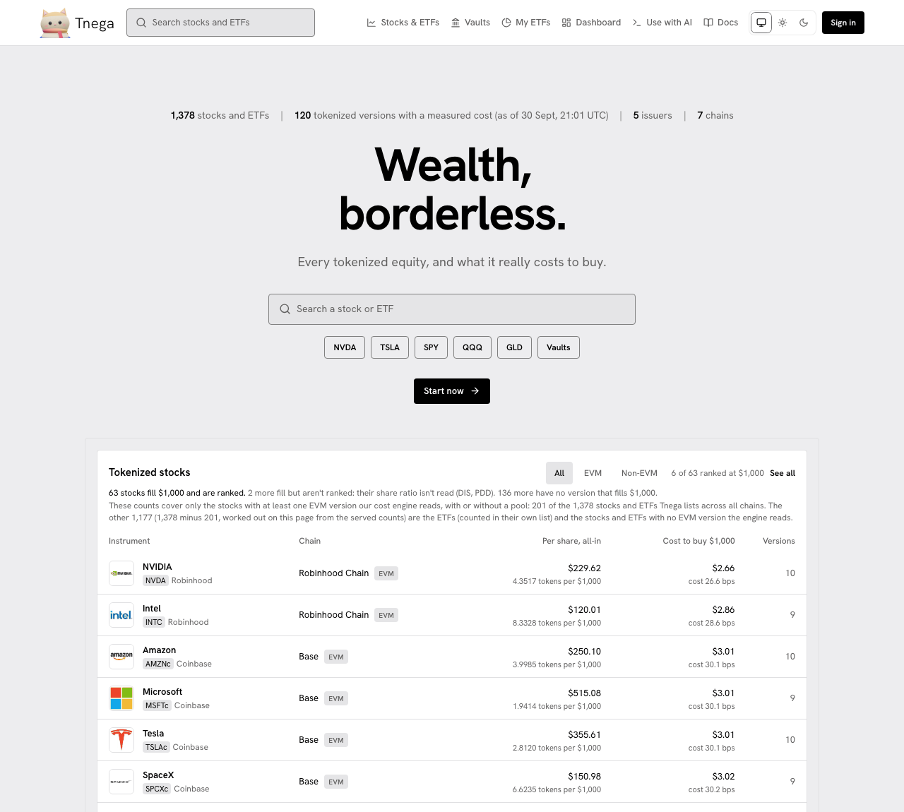

# Tnega

Live: [https://www.tnega.app](https://www.tnega.app)

Tnega lists every tokenized version of a stock or an ETF it can find across
chains, and measures what each one really costs to buy. The same share, NVIDIA
for example, is issued as separate tokens by different issuers on different
chains; each sits in its own pools, with its own depth and its own fees, so
$1,000 of one is not $1,000 of another. Tnega simulates the purchase on each
version's pools at a range of order sizes and shows the result side by side.

On 30 September 2026 at 21:01 UTC the site listed 1,378 stocks and ETFs, from
5 issuers (Robinhood, bStocks, xStocks, Ondo and Coinbase) on 7 chains
(Ethereum, Base, Arbitrum, BNB Chain, Robinhood Chain, HyperEVM and Solana),
and 120 tokenized versions had a measured cost (the counts in the home page's
header at that time). The screenshot's header row was updated on 1 October
2026 to show the Docs link; everything under the header is as taken.

## What is on the site

- **What it costs to buy.** For each version, the all-in price per share at sizes from $100 to $250,000: the pool's price, price impact, the network fee, the L1 fee where there is one and LI.FI's 0.25% fee, over the tokens received, over the shares each token represents. Simulated on the pools, not quoted. See [Stocks & ETFs](stocks-and-etfs.md).
- **Issuer controls.** Who can pause the token, freeze a wallet, burn or seize tokens, upgrade the contract or mint, each read from the contract on chain with the block it was read at; and who may hold the token, in the issuer's own words, linked and dated. See [Issuer controls](issuer-controls.md).
- **Aave V4 collateral on Base.** For each Base version, whether the Aave V4 Equities Hub accepts it as collateral and at what maximum LTV, read on chain at a stated block. Shown on the stock pages.
- **Vaults.** Vaults that take a stablecoin deposit, with their admin, timelock and total value computed from chain reads. See [Vaults](vaults.md).
- **My ETFs.** Baskets of up to five stocks or ETFs, priced by the same cost engine, shared as a link. See [My ETFs](my-etfs.md).
- **Dashboard.** What a connected wallet holds: the total, the allocation by class and every position, read on six chains. See [Dashboard](dashboard.md).
- **Use with AI.** An MCP server that gives your assistant every measurement here, and can prepare an order for you to sign. See [Buy a tokenized stock through your assistant](buy-with-your-assistant.md).

Everything on the site is a measurement, not a recommendation. Tnega never
holds funds or keys and never signs: an order prepared through Tnega is signed
by you, in your own wallet, on a signing page or a stock page's Buy or Sell
tab, or nothing happens. Tnega takes
no fee.

## Buying

There are two routes. On the site, a stock's page has Buy and Sell tabs,
switched on for Base versions only: LI.FI quotes in your browser and you sign
in your own wallet (see [Stocks & ETFs](stocks-and-etfs.md#details-buy-and-sell)).
On every chain an order can be prepared on, an assistant prepares the purchase
through Tnega's MCP server and you sign it on a `tnega.app/sign/…` page. That
route, with screenshots of every step, is
[Buy a tokenized stock through your assistant (step by step)](buy-with-your-assistant.md).

## Also here

- [On-chain agents](onchain-agents.md): Explore agents, the ERC-8004 agent registries Tnega reads on six chains. This is where the project started.
- [Hyperliquid](hyperliquid-order-book.md): the order-book readings tab (post-only rejection per market and per maker) and the Chrome extension, with its practice mode on Hyperliquid's trading pages.

## Reference

- [MCP tools](mcp-tools.md), [Data sources](data-sources.md), [Privacy](privacy.md), [Deployed contracts](deployments.md) and [Tokenized equity measurements and their provenance](tokenized-equity-measurements.md).

Pages that describe earlier parts of the project, such as the agent studio,
native agents, budgets and escrow, the investigations and the hackathon
entries, are kept under **Archive** at the end of the navigation. They
describe the project as it was when each was written, and are not updated.
