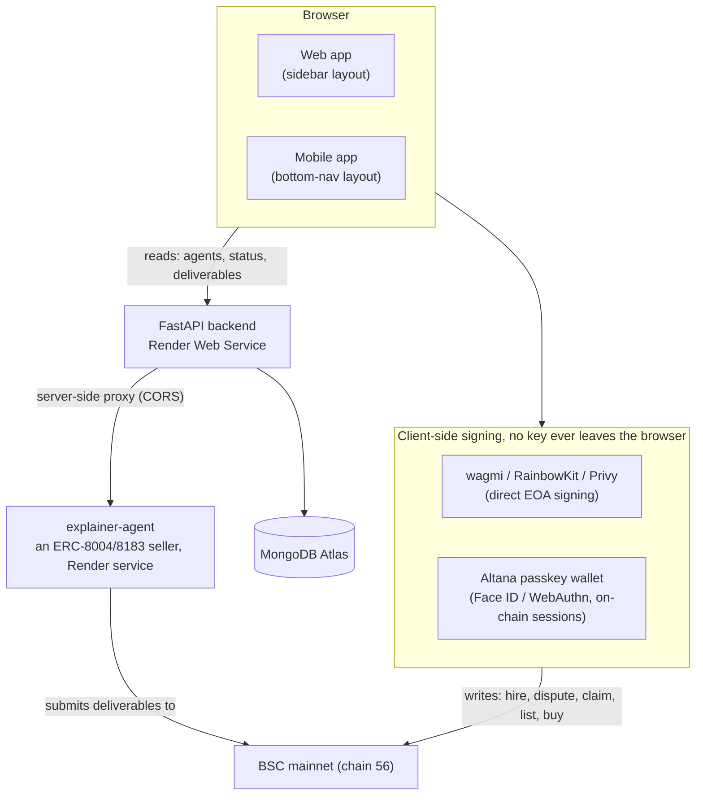

# Architecture

## System overview

Tnega has three separately-deployed pieces: a React frontend (one codebase, two responsive apps), a FastAPI backend, and a MongoDB store. A fourth service, an "explainer agent" listed in the marketplace itself, is an independently-deployed ERC-8004/ERC-8183 seller agent used to demonstrate the hire flow end to end.

**The one rule that shapes everything else:** reads flow through the backend (or straight to chain via a public RPC); anything that moves value is signed in the browser. The backend never holds a private key.

## Frontend

One Vite/React codebase, two separately-designed UIs sharing the same backend and the same core logic:

- `AgentMarketplaceApp.web.jsx`: a sidebar-navigation layout for desktop.
- `AgentMarketplaceApp.mobile.jsx`: a bottom-nav, single-column layout for mobile viewports.

`App.jsx` picks between them at a 768px breakpoint (`window.innerWidth`), and also handles a small set of standalone routes outside the tab structure, `/ecosystem`, `/status`, `/data-sources`, `/partners`, `/docs`, via a plain `pathname` check (no router library; see [Features](features.md) for what each page does). These are genuinely separate, deep-linkable URLs, not tabs. The main app's own tabs (`/market`, `/my-agents`, `/report`, `/learn`, `/build`, `/sell`) get URLs the same way.

Shared logic lives in plain `.js`/`.jsx` modules imported by both apps: the hire flow (`useHireAgent.js`), the Altana SDK wrapper (`altana.js`), job status + deliverable rendering (`JobStatusPanel.jsx`), notifications, wallet-portfolio enrichment, and more, so web and mobile never silently diverge on how a transaction gets built or a job gets read.

## Backend

A FastAPI service (`backend/server.py`) that does three jobs:

1. **Aggregates and serves agent data.** `GET /api/agents` serves instantly from a MongoDB-backed store (`core/agent_store.py`), refreshed in the background, preferentially from `full_agent_registry` (see below; a fix landed 2026-08-27), falling back to a live 8004scan + DefiLlama + an on-chain BNB balance read when that registry isn't populated enough yet, never blocking a page load on a live upstream fetch.
2. **Proxies a handful of CORS-blocked reads** that a browser can't make directly: deliverable content fetches, and ERC-8183 negotiate/notify-funded calls.
3. **Drives the "Build Your Agent" pipeline**, which needs server-side state (a running build process) a browser can't hold.

The full, current list of backend routes is in [Getting Started](getting-started.md#backend-routes).

## Data layer

**MongoDB** (one Atlas deployment, several collections):
- `known_agents`: the durable, curated agent store `GET /api/agents` serves from (never deleted, only upserted, so a slow/rate-limited 8004scan refresh never makes agents disappear). ~12,300 agents as of 2026-08-27, up sharply since being wired to `full_agent_registry` below rather than a small live-fetch sample.
- `full_agent_registry`: a separate, much larger, continuously-growing multi-chain dataset (BSC + Base; ~64,100 docs as of 2026-08-27), built by its own background ingestion/analysis pipeline (`core/full_registry_ingest.py`, `core/full_registry_analysis.py`) for analysis, and, as of 2026-08-27, the preferred source `known_agents` refreshes are diversified from. See [Full Agent Registry Analysis](full-registry-analysis.md) for the full design.
- `explainer_deliverables`: a durable mirror of the explainer-agent's own delivered content (see [Limitations](limitations.md) for why this exists; Render's free-tier disk is ephemeral, so this collection is what survives a restart).
- `canary_tests`: a log of every human-triggered canary test hire (`core/canary.py`); never a spend record on its own, just an after-the-fact log of an already-broadcast transaction. See [Verification Methodology](verification-methodology.md).
- `future_multichain_agents` (superseded, still present but inert): an earlier, much smaller (62-doc) attempt at multi-chain data, predating `full_agent_registry` above and never read by any live-serving route. Left in place rather than deleted, but genuinely superseded; `full_agent_registry` is the current mechanism.
- `practice_runs` (dead, orphaned): leftover data from the removed Practice Mode feature (see [Limitations](limitations.md)); confirmed zero code references anywhere in the current backend. Not read, not written, harmless, just not yet cleaned up.

## Smart contracts

Three independent on-chain systems Tnega reads and writes:

- **ERC-8004 identity registry**: every agent's on-chain identity.
- **ERC-8183 commerce** (Commerce / Router / Policy): the hire/escrow kernel.
- **AgentAccessMarket**: Tnega's own contract for selling ongoing access to an agent.

Full addresses, ABIs-in-spirit, and what each function does are in [Smart Contracts](smart-contracts.md).
