# Buy a tokenized stock through your assistant (step by step)

This page follows one order from start to end: $5 of NVIDIA, paid in USDC, asked
for in plain words to an assistant that has Tnega's MCP server connected. The
assistant prepares the order through Tnega; you open one link and sign in your
own wallet. You do not need to visit the rest of the site.

Every screenshot of the signing page below is the live page at
https://www.tnega.app, opened from a link the live MCP server returned on
30 September 2026 at 21:13:54 UTC. The wallet in the order is an example
address, not a real user's wallet:

```text
0x000000000000000000000000000000000000dEaD
```

Nothing was approved, signed or sent while taking these pictures: the wallet
used for them was a stand-in that answers with an address and refuses every
signing request.

What Tnega does and does not do, in one line: it picks the version, asks LI.FI
for a route, checks the price and writes the order into a signed link. It never
holds funds or keys, never signs, and takes no fee. Every transaction is signed
by you, in your wallet, on the signing page.

## Two routes: the site or your assistant

- **On the site, all six chains.** A stock's page has Buy and Sell tabs. They ask LI.FI for a quote in your browser and you sign in your own wallet, with the same checks as the signing page below; a version with no measured pool price is refused with a short message. See [Stocks & ETFs](stocks-and-etfs.md#details-buy-and-sell).
- **Through your assistant, every chain an order can be prepared on** (Ethereum, Base, Arbitrum, BNB Chain, Robinhood Chain and HyperEVM). The assistant prepares the order through Tnega's MCP server and you sign it on a `tnega.app/sign/…` page. That is the route this page follows.

Either way you sign in your own wallet, LI.FI takes 0.25%, and Tnega takes no
fee.

## Step 0: what you need

- **A wallet on one of the chains an order can be prepared on.** These are Ethereum, Base, Arbitrum, BNB Chain, Robinhood Chain and HyperEVM. The signing page works with any wallet RainbowKit can connect: a browser wallet such as MetaMask, or a phone wallet through WalletConnect.
- **The pay token on that chain.** USDC on Ethereum, Base, Arbitrum and HyperEVM; USDT or USDC on BNB Chain; USDG on Robinhood Chain. The order is worked out with the pay token taken at $1.
- **A little of the chain's gas token**, for two transactions: an approval and the swap. In the example below LI.FI estimated the swap's network fee on Base at 0.000003 ETH ($0.01).
- **The right to hold the token.** Each issuer states who may hold its tokens. The signing page shows the issuer's own words, linked and dated, next to the Sign button. For the version chosen in this example, Coinbase's NVDAc on Base, they read: tokenized stocks are "only available to persons in eligible jurisdictions outside of the U.S." (Base documentation, read 2026-09-25). Tnega shows these terms and does not check who you are.

Amounts from $1 to $10,000 can be prepared. Slippage defaults to 0.50% and can
be set between 0.10% and 3%.

## Step 1: connect Tnega's MCP server to your assistant

The server is hosted; there is nothing to run locally, no key and no account.


The Use with AI screenshot's header row was updated on 1 October 2026 to show
the Docs link; everything under the header is as taken on 30 September.

The endpoint:

```text
https://agents-marketplace-q3k4.onrender.com/mcp
```

In Claude Code, one command writes the config entry and does nothing else:

```bash
npx tnega-mcp
```

What that command runs underneath, if you would rather run it yourself (the
same on macOS, Windows and Linux):

```bash
claude mcp add --transport http tnega https://agents-marketplace-q3k4.onrender.com/mcp
```

For any other MCP client, add the endpoint as a remote HTTP server in that
client's own config. The config shapes differ between clients; the
[Use with AI](https://www.tnega.app/ai) page lists each client's shape with the
date it was read from that client's documentation. Restart the client
afterwards so it reads the config again.

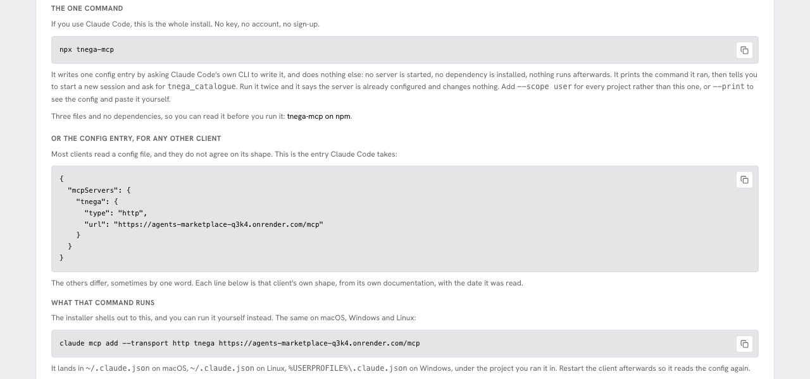

To check the connection, ask your assistant to call `tnega_catalogue`. Nine
tools are listed on [MCP tools](mcp-tools.md); three of them are used for
buying and selling: `tnega_prepare_buy`, `tnega_prepare_sell` and
`tnega_wallet_holdings`.

## Step 2: ask in plain words

Say what to buy, how much in dollars, what to pay with, and the wallet that
will sign and receive:

```text
Buy $5 of NVDA, paying with USDC. My wallet is 0x000000000000000000000000000000000000dEaD.
```

The assistant turns that into one call:

```json
{"name": "tnega_prepare_buy",
 "arguments": {"query": "NVDA", "usd_amount": 5, "pay_with": "USDC",
               "wallet": "0x000000000000000000000000000000000000dEaD"}}
```

With a ticker, Tnega chooses the version (see step 3). To buy one version in
particular, on one chain, the query can be that version's key instead,
`<chainId>/<token address>`. For NVDAc on Base that is:

```text
8453/0xb20000000000000000000078ee7ce2fe4908108c
```

The stock pages on the site show each version's token address.

## Step 3: what the assistant gets back

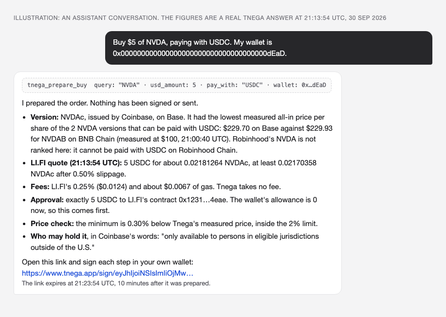

The picture above is an illustration drawn for this page, not a screenshot of
any particular assistant. Its figures are copied from the real answer the live
server gave to the call above, at 21:13:54 UTC on 30 September 2026. That
answer contained:

| Part of the answer | In this example |
|---|---|
| The chosen version and why | NVDAc, issued by Coinbase, on Base: the lowest measured all-in price per share among the 2 NVDA versions with a comparable measured cost that can be paid in USDC ($229.70 all-in per share, gas included, against $229.93 for bStocks' NVDAB on BNB Chain), measured at $100, the measured size nearest $5, at block 52,006,345 (21:00:40 UTC) |
| Versions not chosen, each with its reason | 8, for example Robinhood's NVDA: "cannot be paid with USDC on Robinhood Chain"; Ondo's NVDAon on Ethereum: share ratio not read, "shown, not ranked" |
| LI.FI's quote | 5 USDC for an expected 0.02181264 NVDAc, at least 0.02170358 NVDAc after 0.50% slippage; route Nordstern Finance plus LI.FI's fee step; quoted 21:13:54 UTC |
| Fees | LI.FI's 0.25% fee ($0.0124, taken out of the amount paid) and about $0.0067 of gas. Tnega takes no fee |
| The approval | exactly 5 USDC (5,000,000 units) to LI.FI's contract `0x1231deb6f5749ef6ce6943a275a1d3e7486f4eae`; the wallet's allowance at block 52,006,743 was 0, so it is needed. Never an unlimited approval |
| Balance | the wallet's USDC balance read at block 52,006,743, and whether it covers the order |
| Price check | the quote's minimum valued at Tnega's measured price: 0.30% below what is paid, inside the order's 2% limit |
| Who may hold it | the issuer's words, linked and dated |
| Issuer controls | pause, freeze, burn or seize, upgrade and mint for this token, each read on chain with its block |
| The signing link | `https://www.tnega.app/sign/…`, valid for 10 minutes: this one expired at 21:23:54 UTC |

Nothing is signed or sent by this call. The order is not stored on Tnega's
server either: it travels inside the link, signed by the server so it cannot be
changed on the way.

## Step 4: open the signing link

The link opens a page that shows the order in plain words, with a countdown to
when the link expires.

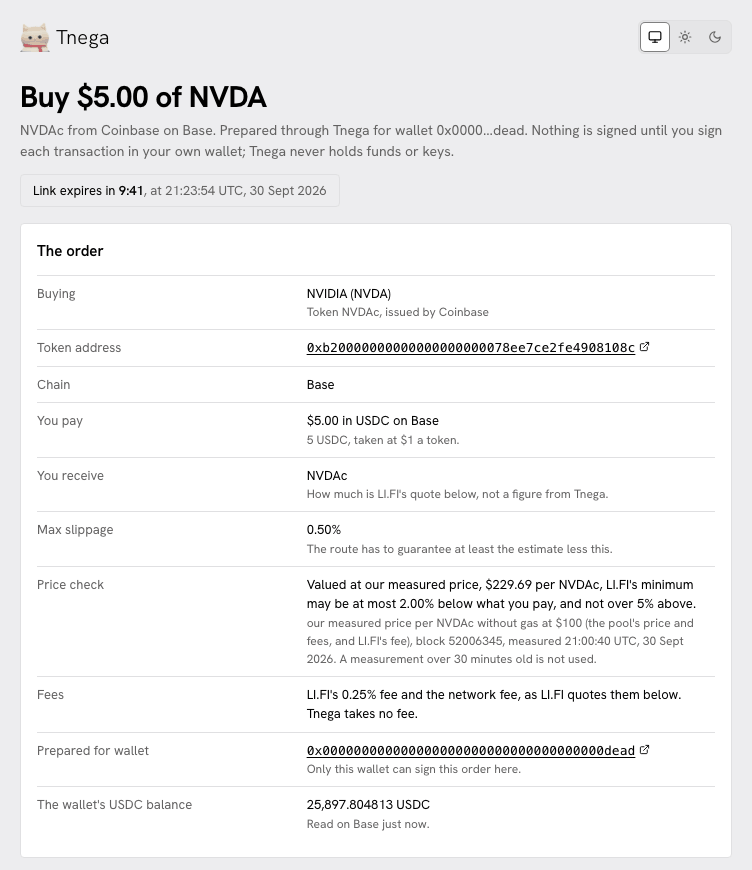

Each line of "The order":

- **Buying, Token address, Chain.** The stock, the issuer's token, its contract (linked to the chain's explorer) and the chain.
- **You pay.** $5.00 in USDC on Base, taken at $1 a token.
- **You receive.** The token. How much is LI.FI's quote, shown in the next card, not a figure from Tnega.
- **Max slippage.** 0.50%: the route has to guarantee at least the estimate less this.
- **Price check.** The measured price the quote will be held against ($229.69 per NVDAc, measured 21:00:40 UTC at block 52,006,345). This is the measured price without gas, so it is a cent below the $229.70 all-in figure the version was chosen by in step 3. The limit: the quote's minimum may be at most 2.00% below what you pay, and not over 5% above. The limit is the smaller of 5% and the larger of 2% and three times the measured cost without gas. A measurement over 30 minutes old is not used.
- **Fees.** LI.FI's 0.25% fee and the network fee. Tnega takes no fee.
- **Prepared for wallet.** Only this wallet can sign this order here.
- **The wallet's balance** of the pay token, read on the chain when the page opened.

## Step 5: get a LI.FI quote

"Get a LI.FI quote" asks LI.FI (li.quest) for a route from your browser, for
the order's wallet. It needs no wallet connected. Each press is one request;
LI.FI allows 75 per browser per 2 hours, and the page shows how many have been
used.

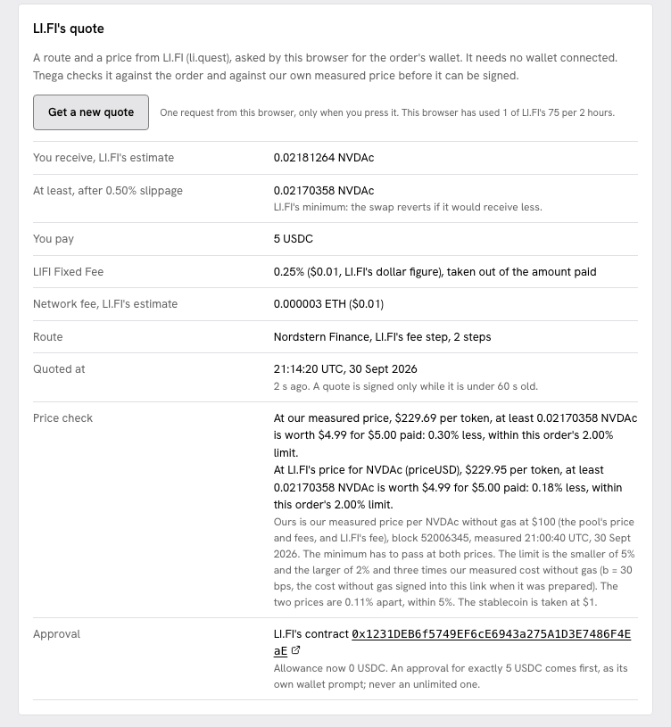

The quote shown here was asked for at 21:14:20 UTC: 5 USDC for an estimated
0.02181264 NVDAc, at least 0.02170358 NVDAc. Before it can be signed the page
checks it:

- it matches the order (chain, tokens, amount, wallet);
- the minimum is not further below the estimate than the order's slippage;
- valued at Tnega's measured price ($229.69) and again at LI.FI's own price for the token ($229.95), the minimum is inside the order's limit. In this quote it was 0.30% and 0.18% below what is paid, against a 2.00% limit;
- Tnega's price and LI.FI's price are within 5% of each other (here 0.11%);
- the route does not go through Jupiter.

A quote can be signed only while it is under 60 seconds old. After that the
page asks for a new one.

The **Approval** line names the contract that will be allowed to take the pay
token: LI.FI's contract on Base (the address is in step 7). The allowance was
0 USDC, so an approval for exactly 5 USDC comes first.

## Step 6: connect your wallet

"Connect a wallet" opens RainbowKit's wallet window. Connecting signs nothing.

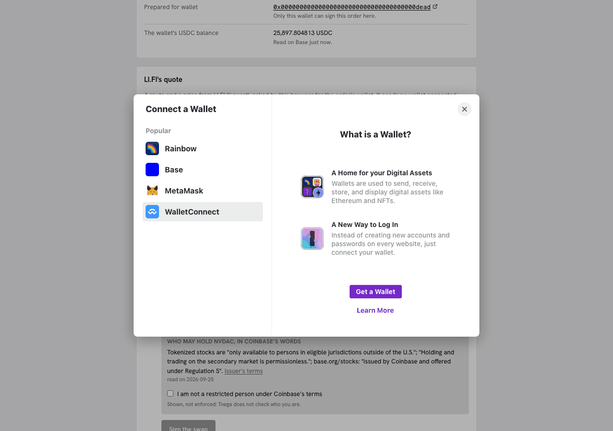

The wallet has to be the one the order was prepared for. Any other wallet is
refused, and nothing is offered for signing:

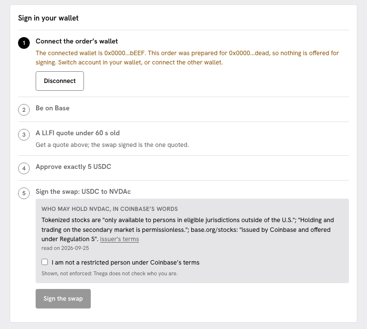

If the wallet is on another chain, the page asks it to switch to the order's
chain, either at once or when you approve.

## Step 7: approve exactly the amount

With the order's wallet connected, on the order's chain, and a quote under 60
seconds old, the steps read:

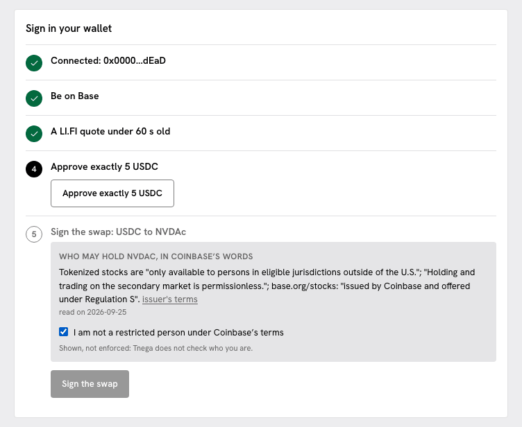

1. Connected: the order's wallet.
2. Be on Base.
3. A LI.FI quote under 60 s old.
4. **Approve exactly 5 USDC.** Your wallet opens an approval for the USDC token. What it shows depends on the wallet, but the facts to check are these: the token is USDC on Base, the amount is exactly 5 USDC, and the spender is LI.FI's contract (both addresses are below the list). If any of these differ, reject it in the wallet. After the approval is mined, the page reads the allowance again, every 2 seconds for up to 30 seconds, and never asks for a second approval.
5. **Sign the swap.** It stays greyed out until the allowance covers the amount and you tick "I am not a restricted person under Coinbase's terms", under the issuer's own words on who may hold the token. The box is shown, not enforced: Tnega does not check who you are.

The two addresses to check in the approval, on Base:

| What | Address |
|---|---|
| USDC, the token approved | `0x833589fCD6eDb6E08f4c7C32D4f71b54bdA02913` |
| LI.FI's contract, the spender | `0x1231deb6f5749ef6ce6943a275a1d3e7486f4eae` |

If the allowance already covers the amount, step 4 is skipped.

## Step 8: sign the swap

"Sign the swap" passes LI.FI's transaction to your wallet as LI.FI built it.
Your wallet shows a transaction from the order's wallet to LI.FI's contract on
Base. The quote's minimum (here 0.02170358 NVDAc) is LI.FI's minimum: the swap
reverts if it would receive less.

Once your wallet has sent it, the page shows the transaction hash with a link
to the chain's explorer, and LI.FI's status for it, checked every 5 seconds
until LI.FI reports it done or failed. The page then tells Tnega's server that
the link was used, so the same link is not offered for signing again. No
transaction was sent for this page, so there is no screenshot of that state.

The issuer's controls on the token are at the foot of the signing page, the
same card a stock page shows:

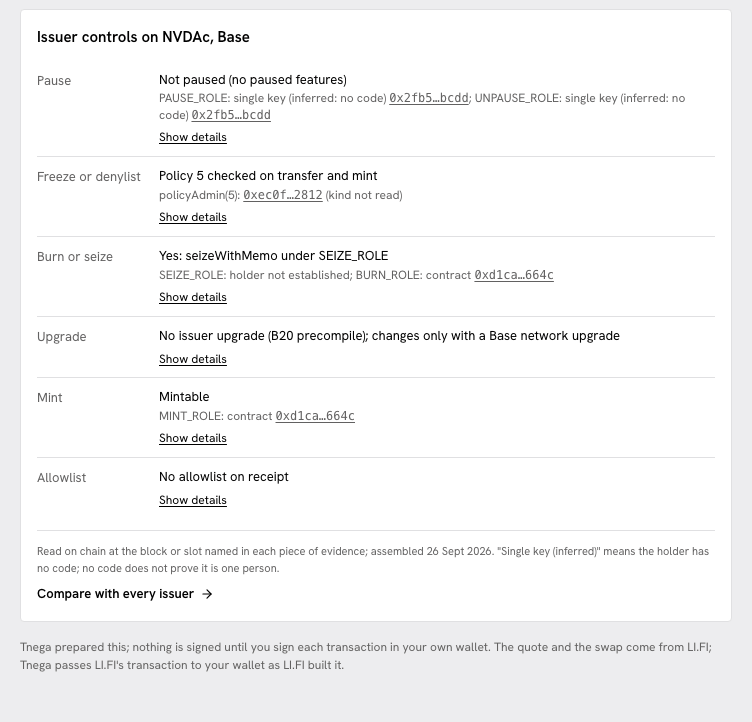

On a phone the page is one column, in the same order:

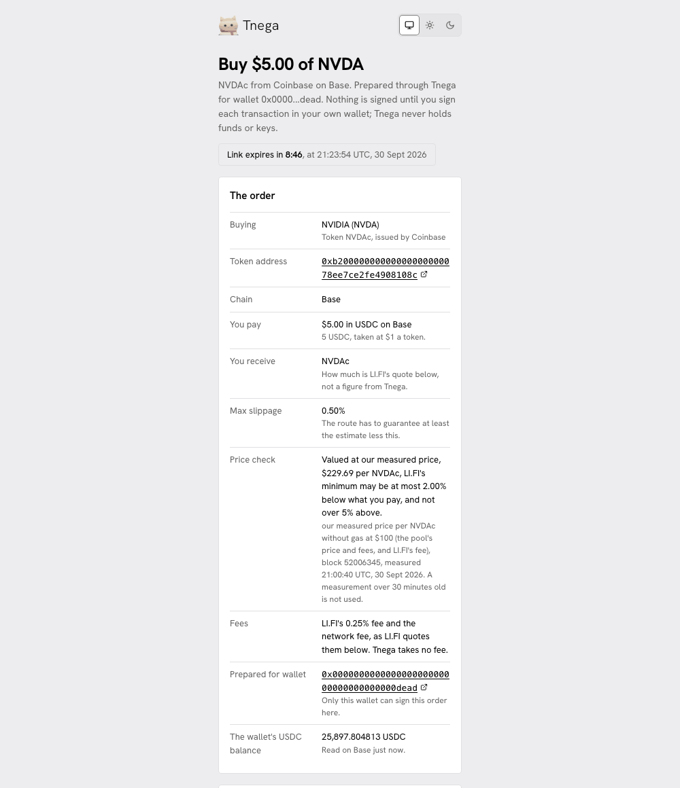

## Step 9: see the token in your wallet

Some wallets show a new token only once you add it. For NVDAc on Base:

| Field | Value |
|---|---|
| Network | Base (chain id 8453) |
| Token address | `0xb20000000000000000000078ee7ce2fe4908108c` |
| Symbol | NVDAc |
| Decimals | 8 |

The address and decimals are the ones in the MCP answer; the signing page reads
the decimals on chain again before it quotes, and refuses the order if they
differ. The token's page on Basescan is
[NVDAc on Basescan](https://basescan.org/token/0xb20000000000000000000078ee7ce2fe4908108c).
Your assistant can also read what the wallet holds with `tnega_wallet_holdings`
(see step 10).

## Step 10: selling, and reading what you hold

Selling works the same way, in the other direction.

- `tnega_wallet_holdings` reads which listed tokenized stocks one wallet holds on Ethereum, Base, Arbitrum, BNB Chain, Robinhood Chain and HyperEVM: `balanceOf` on every version at one block per chain, nonzero balances only, with the chains that were read and the ones that failed.
- `tnega_prepare_sell` takes a version key (or a ticker, then the version the wallet holds most of), a token amount and the wallet. It quotes LI.FI once, checks the price against Tnega's measured pool mid price, and returns the route, an exact approval of the tokens being sold and a signing link. What you receive is the chain's stablecoin unless you ask for another.

For example: "What tokenized stocks does 0x… hold?", then "Sell 0.0217 NVDAc
from that wallet for USDC."

## What the signing page refuses, and why

| The page refuses | Why |
|---|---|
| A link older than 10 minutes | The order's prices and route are only meaningful for a short time. Ask your assistant to prepare a new order |
| A link that was changed or cut short | The order is signed by Tnega's server; a link that fails the check is not valid |
| A link already used | After a transaction hash is reported for a link, it is not offered for signing again. That mark is kept in the server's memory only, so a restart forgets it; the 10-minute expiry is what bounds a link. Check your wallet's activity before asking for a new order |
| A wallet other than the one in the order | Only the wallet the order was prepared for can sign it here |
| A quote over 60 seconds old | What is signed has to be what was just quoted. Get a new quote |
| A stale measured price | The price check uses Tnega's measurement only while it is under 30 minutes old |
| A quote that fails the price check | The minimum is more than the order's limit below what is paid at Tnega's price or at LI.FI's own price, or more than 5% above; or the two prices are more than 5% apart |
| A quote that does not match the order, or routes through Jupiter | LI.FI's answer is not used |
| A balance below the amount | The swap cannot be signed until the wallet holds it |
| Token decimals that disagree with the order | Nothing is quoted or signed; the decimals are read twice, the second time from another endpoint |

Two of those states, as the page shows them:

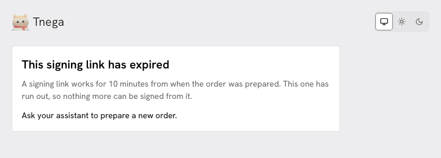

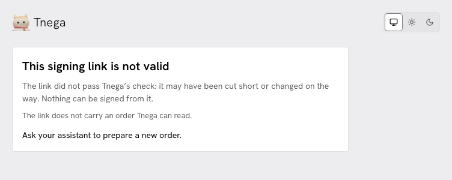

The expired state is the same link as above, opened again after 21:23:54 UTC.
The not-valid state is a made-up link that carries no order.

## Fees

- LI.FI's fee: 0.25% of the amount, taken out of the amount paid (on a sale, out of the tokens sold, so out of what you receive).
- The network fee for the approval and the swap, paid by your wallet in the chain's gas token.
- Tnega: none.

The costs on Tnega's stock pages already include LI.FI's 0.25% fee and gas, so
the figure the version was chosen by and the figure you pay are measured the
same way.

## Where this is described elsewhere

- [MCP tools](mcp-tools.md): the nine tools and what each returns.
- [Stocks & ETFs](stocks-and-etfs.md): how the cost per version is measured.
- [Issuer controls](issuer-controls.md): what each power on a token means.
- [Privacy](privacy.md): what opening a signing link sends, and to whom.
