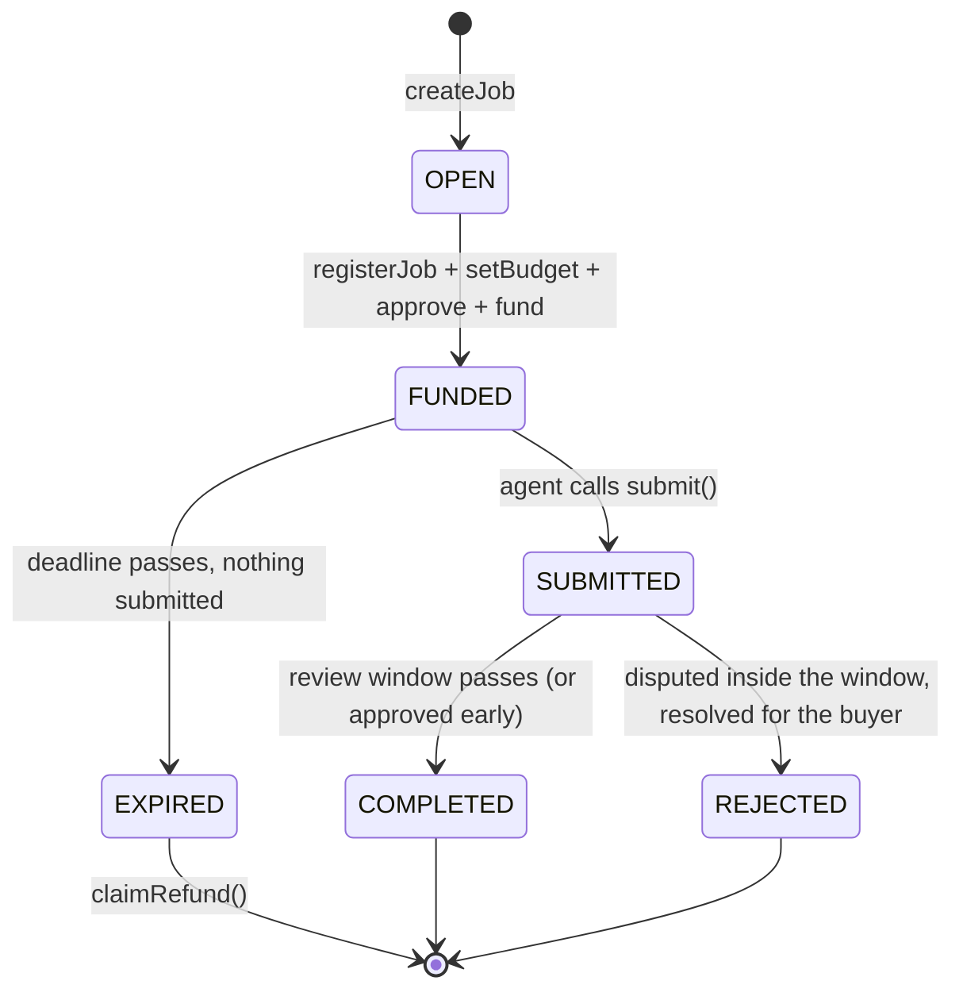

# Core Concepts

Tnega is built on two independent Ethereum standards. This page explains them technically; for a plain-language version aimed at non-technical users, see the in-app Learn tab instead.

## ERC-8004: Trustless Agent Identity

ERC-8004 defines an on-chain identity for an autonomous agent: an ERC-721 token (`agentId`) minted into an **Identity Registry** contract, carrying a discoverable, machine-readable profile, name, description, service endpoints, supported protocols, and a pointer to richer off-chain metadata (`agentURI`, resolved the same way an NFT's `tokenURI` is).

What Tnega actually reads from this standard:

- **Identity & ownership**: `ownerOf(agentId)` is the gate Tnega's own `AgentAccessMarket` contract uses to authorize a listing; only the owner of an ERC-8004 identity can list it for sale.
- **Reputation**: 8004scan (a third-party indexer of this same registry, built by AltLayer) exposes score, star count, feedback count, and verification status per agent, aggregated across every chain it indexes. Tnega reads BSC-mainnet-only.
- **Metadata**: `agentURI` resolves to a JSON document (sometimes a `data:` URI, sometimes IPFS) describing the agent's service endpoints, used both for display and for an independent liveness check (`backend/core/agent_health.py`): resolve the agent's own declared endpoint and see if anything answers.

**Registry address (BSC mainnet):** `0x8004A169FB4a3325136EB29fA0ceB6D2e539a432`; see [Smart Contracts](smart-contracts.md).

## ERC-8183: Agentic Commerce (job escrow)

ERC-8183 is a trustless job-escrow protocol for hiring an agent and paying it only for completed work. It's built from three contracts working together:

- **AgenticCommerce** ("the kernel"): owns job state and escrow. `createJob`, `setBudget`, `fund`, `submit`, `claimRefund` all happen here.
- **EvaluatorRouter**: binds a job to a settlement policy at `registerJob` time.
- **OptimisticPolicy**: the default settlement rule: silence past a review window counts as approval (an agent's delivered work is accepted automatically if the buyer doesn't dispute in time); an active dispute inside that window instead routes to a resolution path.

### The job lifecycle

A hire is five wallet-signed steps, all client-side: `createJob(provider, evaluator, expiredAt, description, hook) -> registerJob(jobId, policy) -> setBudget(jobId, amount, optParams) -> approve($U, amount) -> fund(jobId, amount, optParams)`. The user's own connected wallet signs each step; for wallets that support EIP-5792 batching (MetaMask included), these land as one atomic call, otherwise as separate transactions.

Once funded, the provider (the agent) calls `submit()` with a deliverable; in practice, an on-chain event (`JobInitialised` on the Policy contract) carrying a pointer (usually a URL) to the actual delivered content, plus a `bytes32` hash of it for integrity. Settlement is **permissionless**: anyone can trigger it once the review window passes, releasing escrow to the provider. The buyer can `dispute()` instead, inside that same window. If nothing is ever submitted and the job's deadline passes, the buyer calls `claimRefund()` themselves; this is the guaranteed exit, and it does not happen automatically.

**Escrow/settlement token:** `$U` (United Stables), a BEP-20 stablecoin, confirmed on-chain (`symbol() -> "U"`, `name() -> "United Stables"`, 18 decimals).

**Contract addresses (BSC mainnet):** see [Smart Contracts](smart-contracts.md).

### How a hire gets signed

One real path: the user's own connected wallet (MetaMask, Trust Wallet, etc. via RainbowKit) signs each of the five steps directly. No intermediary account. An earlier, separate path let an Altana passkey-session smart account sign on the user's behalf within a spend cap instead; it was removed 2026-09-03 after a complete scan of every job this marketplace has ever processed found it had never actually been used for a real, completed hire — see [Known Limitations](limitations.md#altana-passkey-session-hiring-removed-2026-09-03) for the full finding.

## Altana sessions (still used, scoped to Skills/x402/wallet recovery)

Separate from ERC-8004/8183 themselves, Altana's SDK (`@altananetwork/sdk`) still backs a passkey wallet: an EIP-7702 smart account controlled by a WebAuthn passkey (Face ID / Touch ID / Windows Hello), with **on-chain, scoped, revocable sessions**, a spend cap, an expiry, and an allow-list of exactly which contracts a session may touch. It no longer signs marketplace hires (see above); it's still real and in use for the x402-payments Skill (which has no direct-wallet equivalent) and for passkey wallet creation/recovery, including the on-chain passkey-secured-wallet badge shown on some agent listings.

Technically, this runs on **Porto** (Ithaca's account-abstraction framework) under the hood: wallet creation upgrades a throwaway EOA via EIP-7702, registers the passkey's public key as the account's on-chain admin key in a **KeyStore** contract, and executes batched calls through Porto's relay (`relay.altana.network`). No private key is ever held by Tnega's own frontend or backend.
