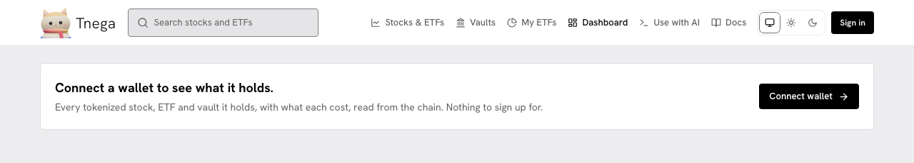
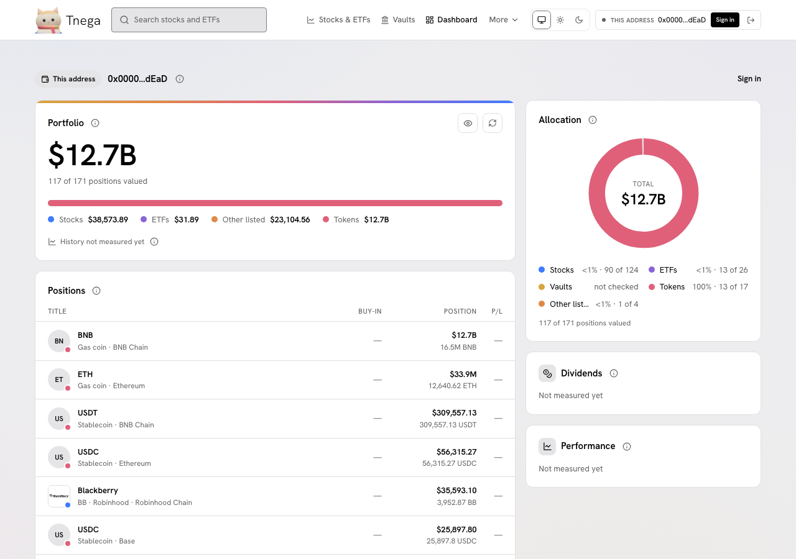
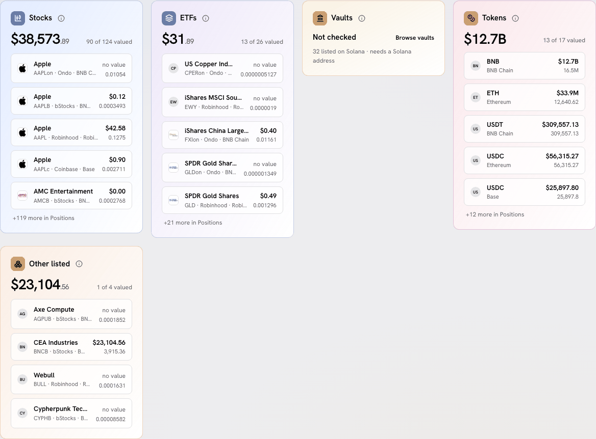
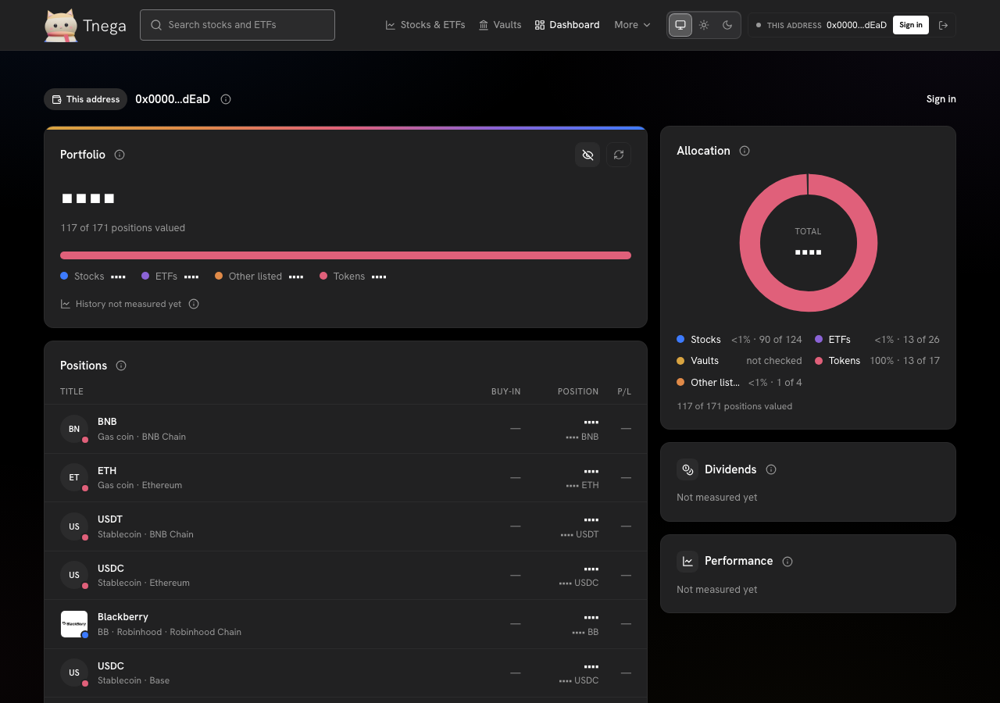
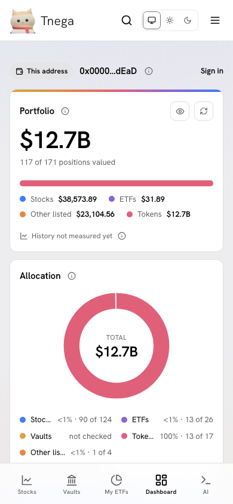

# Dashboard

The Dashboard (`/dashboard`) shows what one wallet address holds: listed
tokenized stocks and ETFs, each chain's own coin and the stablecoins an order
can be paid with, read on chain. Without a wallet connected it asks for one;
there is nothing to sign up for.

The screenshot of this state was taken on https://www.tnega.app on
30 September 2026 at 21:06 UTC. Its header row was updated on 1 October 2026 to show the Docs link; everything under the header is as taken.



Connecting a wallet uses RainbowKit (a browser wallet such as MetaMask, or a
phone wallet through WalletConnect). Connecting is enough to read an address:
the page then calls it "This address". Signing in is a signature over a short
message that moves no funds and approves nothing; "Continue without signing"
skips it.

## The example on this page

The screenshots below were taken on 1 October 2026 between 00:45 and 00:52 UTC,
from this documentation's branch served under https://www.tnega.app and
reading the live API. The connected wallet was a stand-in that answers with an
address and never sends anything. The address is an example:

```text
0x000000000000000000000000000000000000dEaD
```

This is the conventional burn address. No one holds a key for it; tokens sent
there are taken out of circulation, so what it holds is public and belongs to
no one. That is also why its totals are so large: it includes about 16.5
million BNB burned on BNB Chain. The figures are those the site read at that
time.



## What the page shows

**Portfolio.** The sum of the positions that carry a dollar value, with how
many of the positions read were valued (here "117 of 171 positions valued").
Positions without a value are left out of the total, never counted as zero.
From a million dollars up, an amount on the Dashboard is shown with one
decimal ($12.7M, $12.7B, $1.2T), and a balance the same way (16.5M); the
exact figure is in its hover.
A bar and a line under the total split it by class. "History not measured yet":
no value series is stored for a wallet, so there is no chart.

**Allocation.** A donut of each class's share of the valued total, with the
total in the middle. The legend gives each class's share as a whole
percentage; the shares add up to 100. A class with a value above zero that
rounds to 0 reads "<1%", never "0%". Beside each share,
"90 of 124" means 90 of the 124 positions in that class carry a value. Vaults
read "not checked" (see below).

**Positions.** Every position read, largest value first, with its chain and
issuer, its value and its balance. Buy-in and P/L show a dash: Tnega does not
read a wallet's purchases.

**Dividends and Performance.** Both say "Not measured yet". Dividends would
need each token's multiplier changes for the wallet, and performance a
wallet's purchases and a price history; Tnega reads neither yet.

**One card per class.** Below the positions, one coloured card each for
Stocks, ETFs, Vaults and Tokens, and "Other listed" when the wallet holds a
listed version with no stock or ETF type recorded. Each shows the class total,
how many of its positions are valued, and the first five positions, with
"+N more in Positions" for the rest.



**Vaults** are not checked: the vaults Tnega lists are on Solana, and an EVM
address cannot hold them. The card links to the vault list and is not counted
in the total or the allocation.

**Hyperliquid.** Under the class cards, the address's Hyperliquid record: the
perp account value per dex read, open positions and spot balances.

**The eye.** The eye button on the Portfolio card hides every amount on the
page, the Hyperliquid figures included. The choice is kept in this browser
only.



Each (i) next to a title says what that figure covers, where it was read and
when.

## What is read, and from where

- **Stocks, ETFs and Other listed**: `balanceOf` on every listed tokenized version on Ethereum, Base, Arbitrum, BNB Chain, Robinhood Chain and HyperEVM, at one block per chain. On 1 October that was 5,909 versions. Solana and unlisted tokens are not read.
- **Their dollar value**: the balance times the pre-trade mid price of the version's deepest pool, as measured by Tnega's cost engine at a stated block, with the pool's stablecoin counted at $1. A mid price, not what a sale would receive. A version with no measured price shows "no value".
- **Tokens**: each chain's own coin, valued at an on-chain 30-minute average, and the stablecoins an order can be paid with (USDC; USDT and USDC on BNB Chain; USDG on Robinhood Chain), counted at $1. USD1, U, USD₮0 and USDe are read but not valued. No other token is read.
- **Hyperliquid**: the address's record on Hyperliquid, read by the server.

The address is sent in the body of `POST /api/wallet/holdings` and
`POST /api/wallet/habits`, never in a URL. See [Privacy](privacy.md).

## When a read is partial or fails

- While the chains are read, the cards say "Reading six chains…".
- When a chain could not be read, the page names it ("Base not read" or "partly read") with a Retry, and its (i) gives the reason. The totals leave out what was not read, and a class with nothing found says "None found on the chains read", never "Nothing held".
- When no chain answered, the page says "Not read", with a Retry.
- When the server is busy, it says "Server busy" and offers a retry after the time the server gave.

## On a phone

The same cards in one column: Portfolio, Allocation, the class cards, then
Positions. The bottom bar carries the five pages.



## Without the site

`tnega_wallet_holdings` (see [MCP tools](mcp-tools.md)) reads which listed
tokenized stocks a wallet holds on the same six chains, at one block per
chain.
