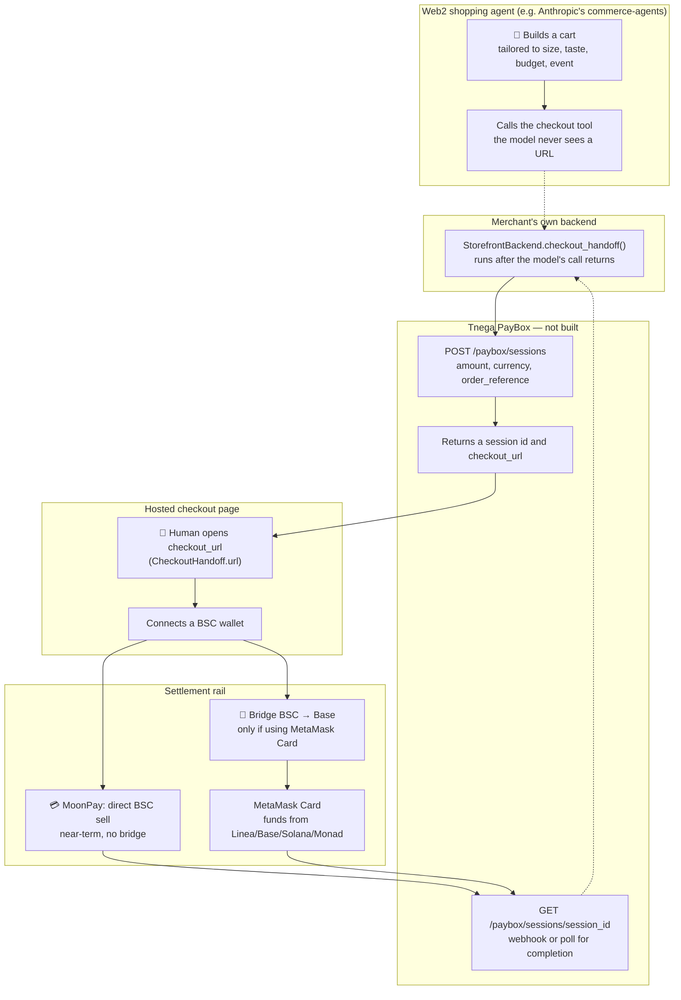

# 🤖 Future: Tnega PayBox (research & design only, not built)

Status: **not implemented.** This page is the architecture and feasibility research for a possible post-hackathon feature — a payment-completion service that open-source Web2 commerce agents could hand a checkout off to, settling through MetaMask Card. Written 2026-09-03 so this can be picked up later without re-researching from scratch. Nothing on this page describes a live Tnega feature.

Surfaced in-app as a "Web2 Agents + PayBox" Coming Soon card in the Native Agent Marketplace — a vision/roadmap summary only, no code behind it, linking back here for the full research. That card also names a second, genuinely separate idea this page doesn't cover: a "describe an agent in a prompt, get one built and wired to payment automatically" platform. That's its own much larger future project — comparable in scope to BNB Agent Studio or Claude Code itself — not scoped here or anywhere in this codebase; noted for the record, not researched.

## The idea in one paragraph

A shopping agent (the kind [Anthropic's own open-source `commerce-agents` blueprint](https://github.com/anthropics/commerce-agents) describes) assembles a cart and then stops — by design, it never places an order or touches payment itself. Something has to render an actual checkout for the human to complete. Tnega PayBox would be that something: a hosted checkout page a merchant's own backend can hand off to, which settles the purchase using crypto the buyer already holds, via MetaMask Card as the fiat rail. The pitch is "pay for anything an AI shopping agent finds you, straight from your on-chain balance, no manual off-ramp."

## The flow, end to end



## Constraint #1: MetaMask Card doesn't support BSC

Confirmed live against MetaMask's own support docs: the card can be funded from **Linea, Base, Solana, and Monad**. BNB Smart Chain is not in that list, and there's no indication it's coming — worth periodically rechecking rather than assuming it stays that way. Since Tnega is BSC-native, a user's escrow balance, staking positions, and trading gains all sit on a chain the card can't spend from directly.

### Bridging BSC → Base

Base is the obvious target: it's both an eligible card-funding chain and a standard EVM chain, so a bridged asset behaves like any other ERC-20 once it lands.

There is **no canonical, trust-minimized bridge between BSC and Base** — the relationship an L2 has to its L1 doesn't exist here, because BSC is a separate L1, not a Base/OP-stack rollup. Confirmed live:

- BNB Chain's own bridge (`bnbchain.org/en/bnb-chain-bridge`, and the open-source [`bnb-chain/canonical-bridge`](https://github.com/bnb-chain/canonical-bridge) widget/SDK) is itself an **aggregator** — it pools liquidity from Celer, deBridge, and Stargate rather than running its own native bridge. It's a chain-team-endorsed entry point, but still routes through third-party bridge protocols underneath, not a first-party guarantee.
- **Circle's CCTP** (the canonical, burn-and-mint USDC bridge) doesn't include BSC. That rules out the cleanest possible path for USDC specifically — any BSC→Base USDC move goes through a liquidity bridge, not a native mint.
- For USDT, **Stargate** (LayerZero V2) is the best-regarded liquidity-bridge route between BSC and Base.
- **deBridge** is cited as the strongest overall pick into Base in 2026 (speed, security, chain coverage) if the asset isn't USDT/USDC specifically.

A BSC→Base leg is buildable, but it's an extra hop through a third-party liquidity bridge — fees, a settlement delay anywhere from ~10 seconds to a few minutes depending on protocol, and a trust surface beyond BSC's and Base's own security, not a clean native transfer. Whatever this becomes should probably integrate a bridge-aggregator API (Li.Fi and Socket are the standard programmatic equivalents of BNB Chain's own consumer-facing widget) rather than hardcoding one bridge protocol — the same "don't assume one liquidity source" discipline this project already applies elsewhere (see `docs/venus-skill-revert-investigation.md`'s wallet-balance handling, or the Trading Agent's own multi-DEX comparison).

## Constraint #2: MetaMask Card's own signups are paused

This wasn't part of the original ask but changes the picture enough to state plainly. Confirmed live: MetaMask paused new **US** Card signups and halted Metal card orders globally on **June 2, 2026**, with **no restoration date given** as of the most recent reporting found (July 2026). Existing cardholders are unaffected. Virtual-card signups remain open in a defined set of non-US regions (UK, EEA, Canada, Switzerland, and core LATAM: Argentina, Brazil, Colombia, Mexico).

This is a second, independent blocker on top of the chain gap, entirely outside Tnega's control — a design built around MetaMask Card right now would be building toward a rail that isn't accepting new US users at all. Worth a periodic recheck (there's a reasonable chance this reopens before the BSC gap does, since it reads as a regulatory/operational pause rather than a structural limitation), but not something to build against today.

## Architecture: how a commerce agent actually hands off

Read Anthropic's `commerce-agents` source directly rather than assuming an MCP-server shape, since that assumption turned out to be wrong. The extension point is much simpler than an MCP tool call — worth stating precisely because it's the one piece of this design that's already fully confirmed and stable to build against:

```python
# shopping-agent/core/shopping_agent/backend.py
async def checkout_handoff(
    self, session: ShoppingSessionContext, cart: Cart
) -> list[CheckoutHandoff]:
    """Optional: where this cart is paid for when that is not a route in the
    host app, such as the platform's hosted checkout URL, or one URL per
    seller on a marketplace. The executor puts the result on the ``checkout``
    card's payload after the model's call, so the URL is never a tool
    argument and never reaches the model."""

class CheckoutHandoff(BaseModel):
    url: str
    label: str | None = None   # button text; the host has a default
    seller: str | None = None  # set when the cart hands off per seller

class Cart(BaseModel):
    items: list[CartItem]
    currency: str = "USD"
    # .subtotal is computed from items

class CartItem(BaseModel):
    product_id: str
    title: str
    price: float
    quantity: int
    # + image_url, option_values, variant_of
```

Three things this confirms, precisely:

1. **The agent (Claude) never sees the checkout URL or any payment detail.** `checkout_handoff()` runs on the deploying merchant's own backend, after the model's own tool call returns — a deliberate security boundary, not an oversight. Tnega PayBox has no reason to be an MCP server or a tool the agent calls; there's no agent-facing surface to build at all.
2. **The integration point is the merchant's own `StorefrontBackend` implementation**, not the agent framework. A merchant wanting to offer "pay with crypto via Tnega PayBox" implements `checkout_handoff()` to construct a `CheckoutHandoff(url=<PayBox-hosted checkout URL>, label="Pay with crypto")`, alongside (not instead of) whatever normal fiat checkout URL they already return — `checkout_handoff()` returns a **list**, so multiple payment options coexisting is already how the framework expects this to work.
3. **The shape Tnega PayBox needs to expose is a session-based checkout API**, the same pattern Stripe Checkout or a hosted on-ramp widget already uses, not anything novel:
   - `POST /paybox/sessions` — merchant backend calls this when building `checkout_handoff()`, passing `{amount, currency, merchant_id, order_reference, success_url, cancel_url}` (`Cart.subtotal` / `Cart.currency` map directly onto this).
   - Response: `{session_id, checkout_url}` — the `checkout_url` is exactly what goes into `CheckoutHandoff.url`.
   - The hosted `checkout_url` page is where the actual "connect BSC wallet → bridge to Base → settle via MetaMask Card" flow (or whatever the settlement path ends up being) happens, entirely outside the agent's own context.
   - A webhook or polling endpoint (`GET /paybox/sessions/{id}`) lets the merchant's own backend confirm completion, mirroring how this project's own `useJobActions.js`/`JobStatusPanel.jsx` already poll on-chain job status rather than assuming.

This is a genuinely small, well-defined surface — the hard part of this feature was never "how does an agent call into it," it's "does the settlement rail underneath actually work from BSC," which the two constraints above answer plainly: not yet.

## Scope check

**Not a near-term buildable feature as originally scoped (BSC → bridge → MetaMask Card).** Both blockers are external and outside this project's control:

- The chain gap requires either MetaMask adding BSC support (no signal this is planned) or accepting an added bridge hop with its own cost/delay/trust surface.
- The signup pause is a live, unresolved MetaMask-side restriction with no stated end date.

Both facts are worth rechecking before resuming this work, not assuming either has changed.

## An alternative worth considering instead of MetaMask Card specifically

Checked whether a different settlement rail sidesteps the chain problem entirely, since the user asked. It does:

- **MoonPay** confirmed live to support BNB Smart Chain directly as both a buy and sell network, settling a sale to a bank account — no bridge needed at all.
- **Transak** powers the "Sell" button inside MetaMask itself and advertises 80+ source networks; BSC/BEP-20 coverage is broad but wasn't confirmed token-by-token in this pass (a genuine gap, not assumed clean).
- Checked as a possible self-custody-card alternative to MetaMask Card: **Gnosis Pay** (Safe-based, self-custodial) — supports Ethereum, Polygon, and Gnosis Chain, not BSC. Same structural gap as MetaMask Card, not an improvement.

The tradeoff: going this route means Tnega PayBox settles to a **bank payout** (or whatever card-topup rail MoonPay/Transak themselves offer), not specifically a *self-custody Mastercard debit card* the way the original MetaMask Card concept was. That's a different product shape — "instant, no-bridge fiat off-ramp for a checkout" rather than "spend BSC crypto on any card anywhere" — worth deciding on explicitly rather than treating as equivalent. It is, however, the one path here that's actually buildable against BSC today, with no dependency on an external company lifting a signup pause or adding chain support.

## Recommended next steps, when this is picked back up

1. Recheck both MetaMask Card constraints (BSC chain support, US signup pause) before writing any code.
2. Decide the settlement rail question directly: MetaMask Card + bridge (higher user appeal, two external blockers) vs. MoonPay/Transak direct BSC off-ramp (buildable now, different product shape — bank payout, not a spend-anywhere card).
3. If the bridge path is chosen, prototype against a bridge-aggregator API (Li.Fi or Socket) rather than one hardcoded protocol, and get a measured end-to-end latency/fee number before committing to the UX around it.
4. Build `POST /paybox/sessions` / `GET /paybox/sessions/{id}` against the `CheckoutHandoff` shape above — that part of the design doesn't depend on either open question above and could be built and tested independently.
5. Reference implementation to build against: a `StorefrontBackend.checkout_handoff()` that returns a Tnega PayBox URL alongside a normal fiat option, exercised against Anthropic's own `commerce-agents` examples (`examples/retail/`, etc.) rather than a fresh mock.
