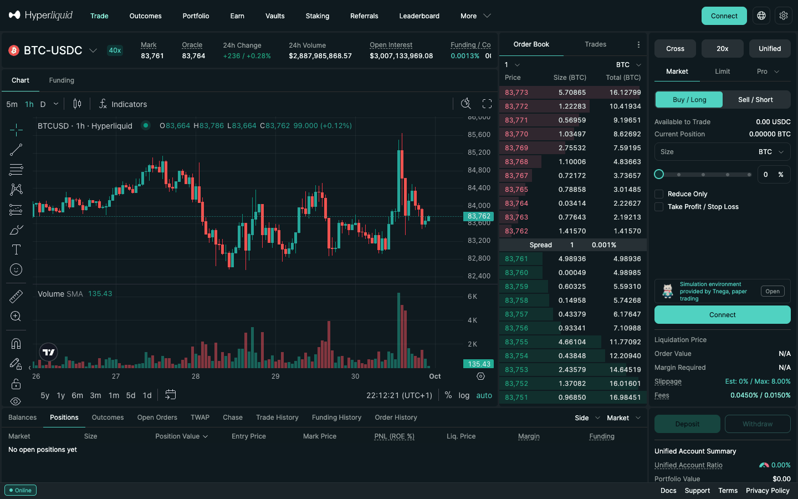
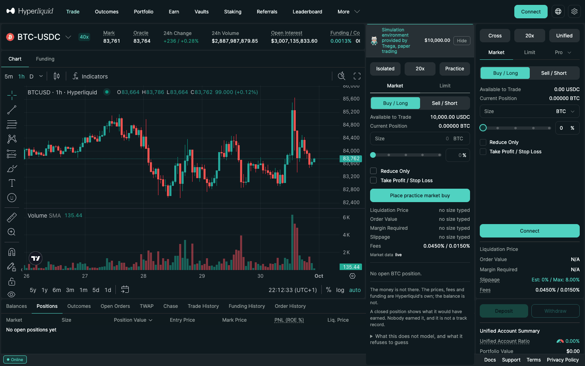
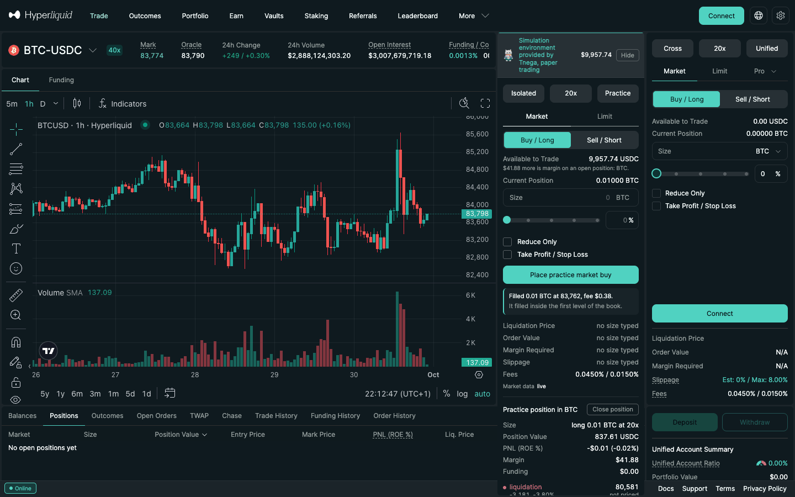

# Hyperliquid extension and practice mode

Tnega's Chrome extension adds two things to app.hyperliquid.xyz:

- on an **address page**, a panel with that address's post-only rejection rate, the same measurement as the [Hyperliquid tab](hyperliquid-order-book.md);
- on a **trading page**, a **practice mode**: a simulation environment where you place pretend trades against Hyperliquid's live public prices with a pretend balance. No order is sent to Hyperliquid, nothing is signed, and your real account is not touched.

The screenshots below were taken on 30 September 2026 (the practice mode ones
at 21:12 UTC, the address panel at 21:35 UTC), in a fresh browser profile with the extension loaded unpacked from the
repository's `extension/` folder and no wallet
installed. Hyperliquid's own Connect button was never used. The extension is
published on the Chrome Web Store; the Hyperliquid tab links to it.

## The panel on an address page

Open any address on Hyperliquid's explorer, for example
[the explorer page of 0x0104…703a](https://app.hyperliquid.xyz/explorer/address/0x010461c14e146ac35fe42271bdc1134ee31c703a).
The extension reads the address from the page's URL and adds a panel above
Hyperliquid's own content.

For this address the panel showed:

- that Hyperliquid reports it as a vault (HLP Strategy A), so the rate describes that strategy rather than one person's trading;
- the post-only rejection rate, 0.0%, in the Quoting band, with a line for the last 49 hours;
- the counts behind it: 1,184 of 2,915,266 post-only orders rejected, 1,466 polls stored, and when the newest order was seen;
- what it does not say: whether the address is any good or makes money;
- its positions now, read on HyperCore through a contract on HyperEVM, with the HyperCore block.

The panel appears on every Hyperliquid address page. For an address that was
never polled it says why no rate can be stated. The "–" button folds it away.

## Practice mode on a trading page

On a trading page such as [app.hyperliquid.xyz/trade/BTC](https://app.hyperliquid.xyz/trade/BTC), the extension
adds a small tab that reads "Simulation environment provided by Tnega, paper
trading", with an **Open** button. Closed, that tab is all it adds. It sits in
an empty band of Hyperliquid's order form.

**Open** shows the practice panel over Hyperliquid's order book, with a pretend
balance of $10,000. It works like their order form: isolated margin, leverage
(20x here), Market or Limit, Buy / Long or Sell / Short, a size in the coin or as
a percentage, Reduce Only, and Take Profit / Stop Loss. The fees are
Hyperliquid's own schedule (0.0450% / 0.0150% here), and "Market data: live"
says the prices are being read. **Hide** closes it back to the tab.

After "Place practice market buy" with a size of 0.01 BTC, the panel reported
"Filled 0.01 BTC at 83,762, fee $0.38. It filled inside the first level of the
book." and showed the practice position: size, position value, profit and loss,
margin, funding, and a ladder of prices from liquidation to entry and mark with
what closing there would realise.

What the panel says about itself, in its own words:

- "The money is not there. The prices, fees and funding are Hyperliquid's own; the balance is not."
- "A closed position shows what it would have earned. Nobody earned it, and it is not a track record."
- "What this does not model, and what it refuses to guess" opens the list: for example, a resting order is filled only once the mark has gone clear through its level (queue position is not public), and liquidation's backstop liquidity and fee are not simulated.

The **Practice** button at the top of the ticket opens the "Practice account" sheet: the balance, what it started with, and the margin on open positions. The account is kept in the extension's storage in this browser; it does not sync to any device or account, nothing is sent anywhere, and clearing a site's data does not erase it. Its "Reset practice account" button closes every open position without recording it and puts the balance back to where it started; removing the extension also erases it.

## Where else it runs

On etherscan.io, bscscan.com, basescan.org, arbiscan.io, monadscan.com,
hyperevmscan.io, robinhoodchain.blockscout.com and 8004scan.io, the same
extension shows a panel about a registered ERC-8004 agent when the address or
agent on the page is one Tnega has measured. What the extension reads on each
site is set out on the site's [privacy page](https://www.tnega.app/privacy).
