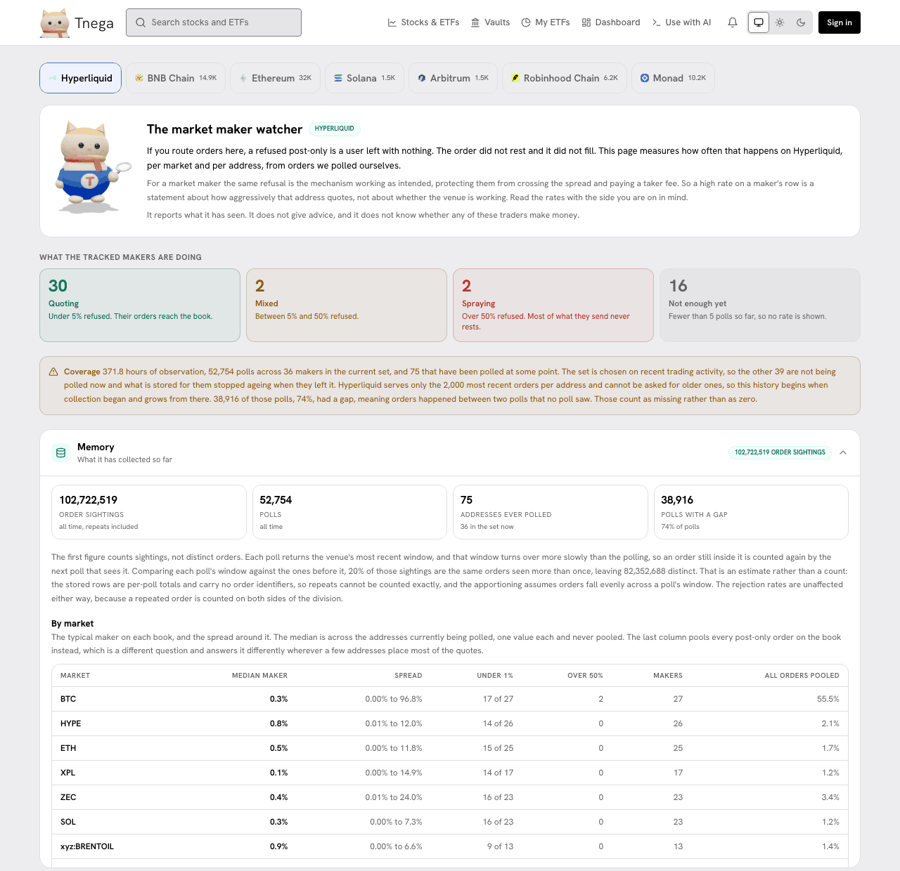

# Hyperliquid order-book readings

The Hyperliquid tab (`/chain/hyperliquid`, the first tab of Explore agents)
measures how often post-only orders on Hyperliquid are refused instead of
resting on the book, per market and per market-making address, from orders
Tnega polled itself. The tab can take a while to load its data.

The screenshot was taken on https://www.tnega.app on 30 September 2026 at
21:08 UTC.

## What it measures, and for whom

A post-only order either rests on the book or is refused; it never takes. If you
route orders for someone else, a refused post-only order leaves that person
with nothing: it did not rest and it did not fill. For a market maker the same
refusal is the venue protecting them from crossing the spread and paying a
taker fee, so a high rate on a maker's row describes how aggressively that
address quotes, not whether the venue works. The tab reports what it has seen;
it does not say whether any of these traders make money.

## The parts of the tab

- **What the tracked makers are doing.** The tracked addresses in four bands: Quoting (under 5% refused), Mixed (5% to 50%), Spraying (over 50%) and Not enough yet (fewer than 5 polls, so no rate is shown). On 30 September: 30, 2, 2 and 16. The bands count the 50 addresses in the tab's maker table (up to 50 are served): the 36 in the current polling set first, then 14 of those that have left it, by volume. So they are neither the 36 in the set nor all 75 ever polled.
- **Coverage.** Hours of observation, polls, how many makers are in the current set and how many were ever polled, and how many polls had a gap (orders between two polls that no poll saw, counted as missing rather than zero). On 30 September: 371.8 hours, 52,754 polls, 36 makers in the set, 75 ever polled, and 38,916 polls (74%) with a gap. Hyperliquid serves only the 2,000 most recent orders per address, so the history begins when collection began.
- **Memory.** Order sightings, polls, addresses and polls with a gap, with a note on why sightings are not distinct orders.
- **By market.** Per market, the median maker's rate, the spread across makers, how many makers are under 1% and over 50%, and the rate with every post-only order on the book pooled. Where the median and the pooled figure disagree sharply, a few addresses are placing most of the quotes.
- **By maker.** Per address: 30-day volume (the venue's own ranking), post-only orders, refused, the rejection rate, the last 48 hours, cancels per fill, fill rate and polls. Vaults are marked, and addresses that submit through a front-end charging a builder fee are counted separately.
- **Workspace, Brain, On chain now.** What the collectors can reach, one measured window of 2026-09-19 over 8 addresses, and which tracked addresses hold a position on HyperCore now.

## Collection status

The site's footer marks this link "collector suspended since 19 Sept". That
refers to the WebSocket collector behind the 10-second series: it was suspended
on 2026-09-19 after the study it was run for had its windows, so every series
ends on that date. The rejection rates on this tab come from a separate REST
collector, which is current (the MCP dataset `hyperliquid.post_only` states
both in its caveats).

The same measurement appears on Hyperliquid's own address pages through the
Chrome extension: see [Hyperliquid extension and practice mode](hyperliquid-extension.md).
