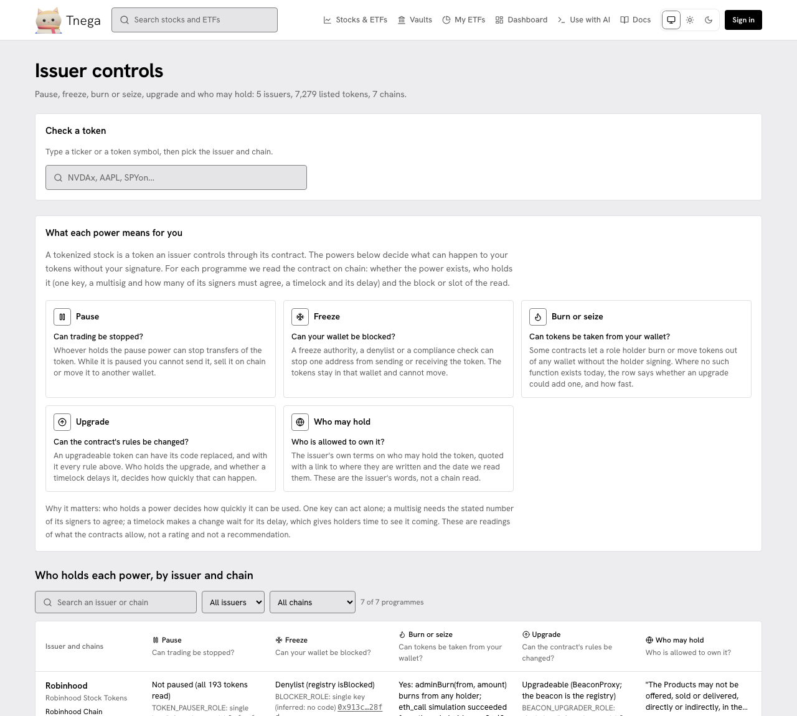

# Issuer controls

A tokenized stock is a token its issuer controls through a contract. Some of
what the contract allows can happen to your tokens without your signature.
Issuer controls (`/issuer-controls`) reads, for each issuer's programme on each
chain, whether each power exists, who holds it, and the block or slot the read
was taken at. It is reached from the home page, the footer and every stock
page.

The screenshot was taken on https://www.tnega.app on 30 September 2026 at
21:06 UTC. The page then covered 5 issuers, 7,279 listed tokens and 7 chains.
Its header row was updated on 1 October 2026 to show the Docs link; everything under the header is as taken.

## The powers

| Power | The question it answers | What is read |
|---|---|---|
| Pause | Can trading be stopped? | Whether a pause exists, whether the token is paused now, and who holds the role |
| Freeze or denylist | Can your wallet be blocked? | A freeze authority, a denylist or a compliance check that can stop one address sending or receiving |
| Burn or seize | Can tokens be taken from your wallet? | A function that burns or moves tokens from any holder without the holder signing; where none exists, whether an upgrade could add one, and how fast |
| Upgrade | Can the contract's rules be changed? | Whether the code can be replaced, by whom, and behind what delay |
| Mint | Can more be issued? | Whether the token is mintable and who holds that role (on the card for one token, on a stock page and the signing page; not a column of this page's table) |
| Who may hold | Who is allowed to own it? | The issuer's own terms, quoted, linked and dated. These are the issuer's words, not a chain read |

For each role holder the page says what it is: a single key (an address with
no code; "inferred", because no code does not prove it is one person), a
multisig with the number of its signers that must agree, or a contract, and
whether a timelock delays it. "Show details" opens the evidence: the function
or storage slot read and the block.

Two examples from the page on 30 September:

- Robinhood's tokens on Robinhood Chain (193 tokens): not paused; a denylist (the registry's `isBlocked`); burn from any holder through `adminBurn(from, amount)`, with an `eth_call` simulation that succeeded from the role holder at block 73,181,719; upgradeable through a BeaconProxy.
- bStocks on BNB Chain (80 tokens): not paused; a blocklist and sanctions list in a compliance contract; no direct burn function, but reachable by an upgrade with no delay.

These are readings of what the contracts allow. They are not a rating and not a
recommendation.

## Where else the same card appears

- On each stock page, for the version shown in detail ([Stocks & ETFs](stocks-and-etfs.md)).
- On the signing page, for the token being bought or sold ([step 8 of the buying guide](buy-with-your-assistant.md)).
- In `tnega_prepare_buy` and `tnega_prepare_sell` answers, under `controls` ([MCP tools](mcp-tools.md)).
