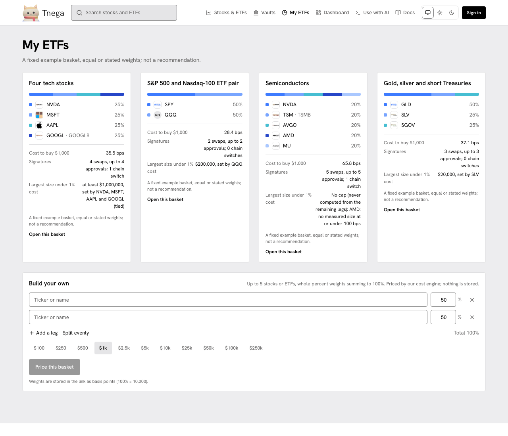

# My ETFs

My ETFs (`/my-etfs`) prices a basket of up to five stocks or ETFs with the
same cost engine as the stock pages, and gives it a link you can share. Nothing
is stored: the weights live in the link.

The screenshot was taken on https://www.tnega.app on 30 September 2026 at
21:05 UTC. Its header row was updated on 1 October 2026 to show the Docs link; everything under the header is as taken.

## The example baskets

Four fixed example baskets, equal or stated weights, none a recommendation.
For each, on 30 September:

| Basket | Cost to buy $1,000 | Signatures | Largest size under 1% cost |
|---|---|---|---|
| Four tech stocks (NVDA, MSFT, AAPL, GOOGL) | 35.5 bps | 4 swaps, up to 4 approvals; 1 chain switch | at least $1,000,000 |
| S&P 500 and Nasdaq-100 ETF pair (SPY, QQQ) | 28.4 bps | 2 swaps, up to 2 approvals; 0 chain switches | $200,000, set by QQQ |
| Semiconductors (NVDA, TSM, AVGO, AMD, MU) | 65.8 bps | 5 swaps, up to 5 approvals; 1 chain switch | none: AMD has no measured size at or under 100 bps, so no basket size stays under 1% |
| Gold, silver and short Treasuries (GLD, SLV, SGOV) | 37.1 bps | 3 swaps, up to 3 approvals; 0 chain switches | $20,000, set by SLV |

Each leg is bought as its own swap, so a basket of five legs is up to five
approvals and five swaps, plus a switch each time the next leg is on another
chain. "Largest size under 1% cost" is the largest basket size at which every leg,
at its weight, still has a measured cost of 1% (100 bps) or less, and the leg
that sets it.

## Build your own

Pick up to five stocks or ETFs, give whole-percent weights that sum to 100%
("Split evenly" does it for you), choose a size from $100 to $250k and press
"Price this basket". The weights are stored in the link as basis points
(100% = 10,000).

The baskets are priced, not bought: the site's Buy switch is off.
