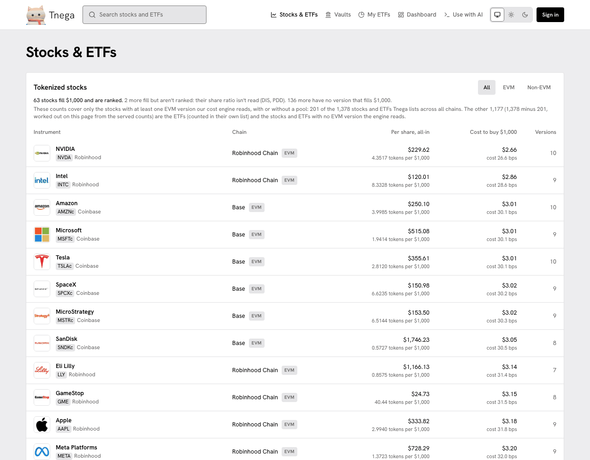
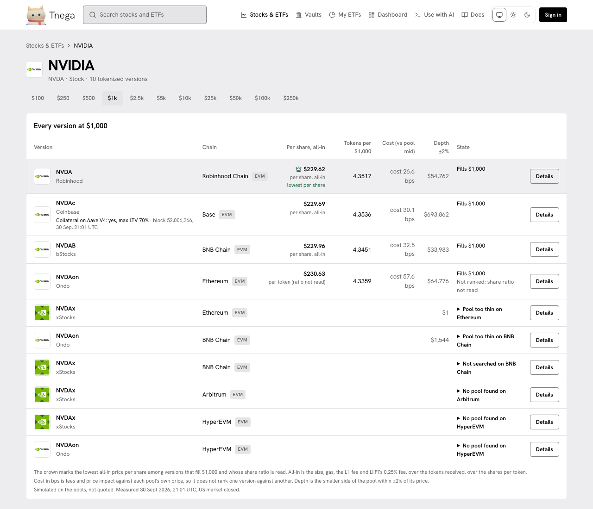
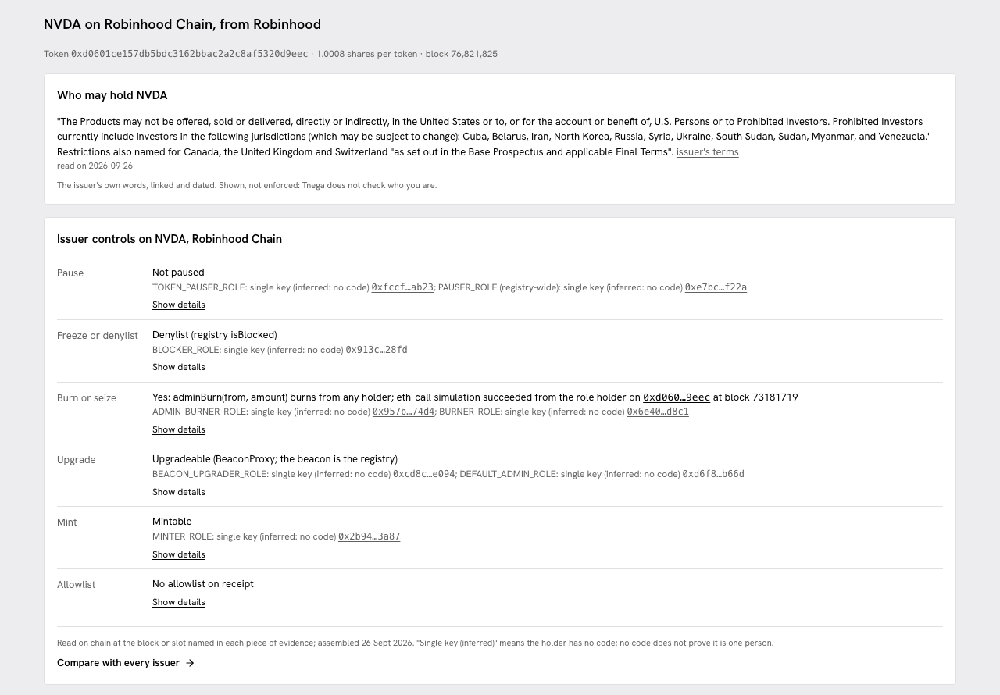
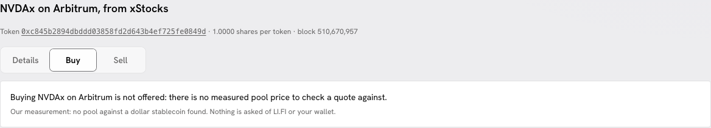
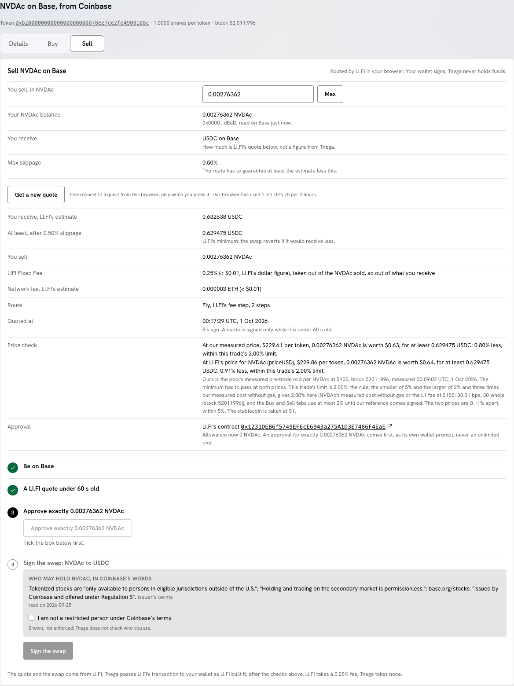
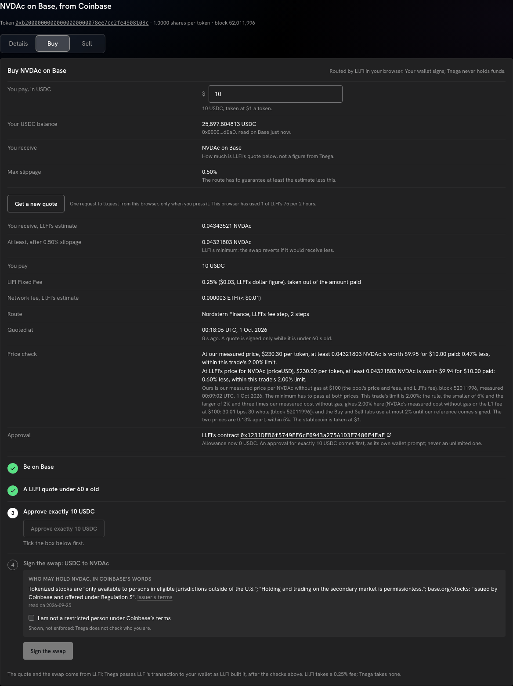
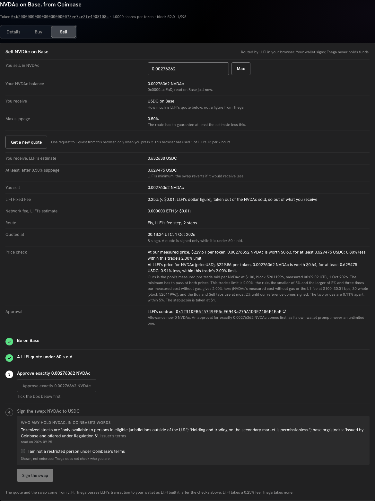
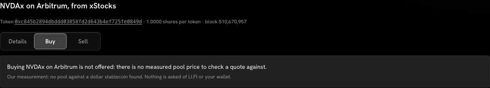
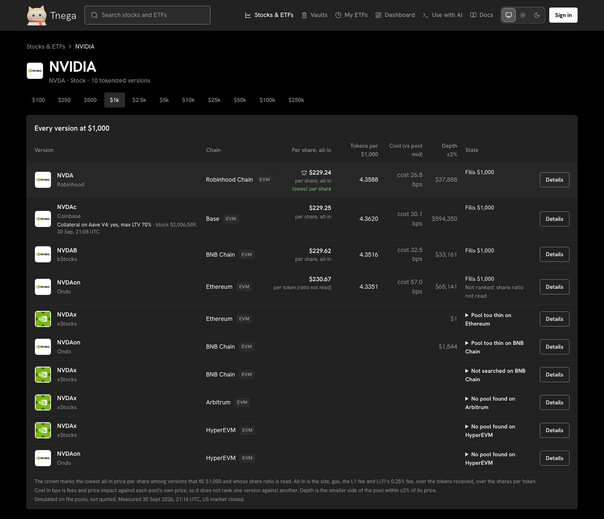
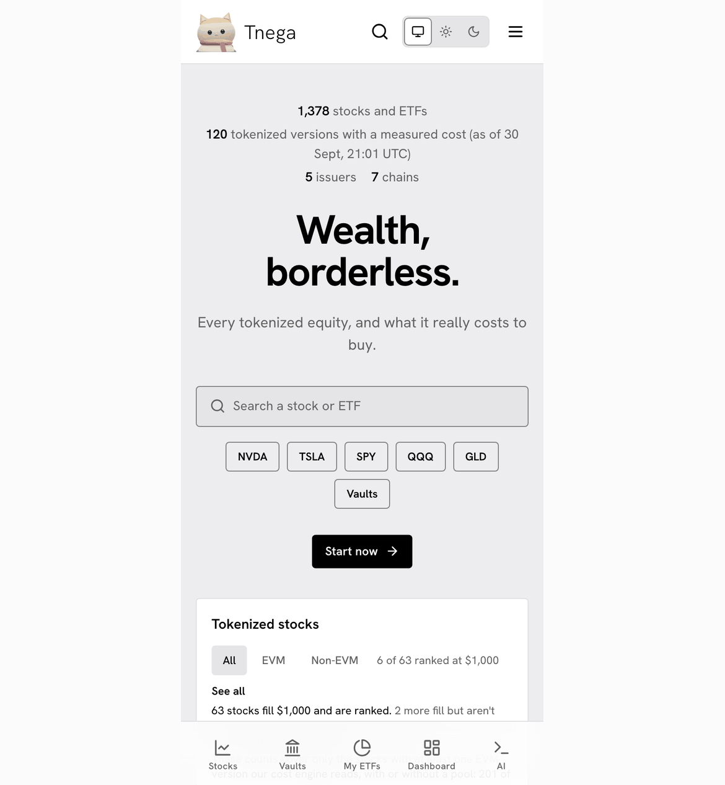

# Stocks & ETFs, and a stock's page

The screenshots on this page, except those of the Buy and Sell tabs (dated in
their own section), were taken on https://www.tnega.app on
30 September 2026 between 21:05 and 21:17 UTC. The figures in them are the
ones the site served at that time, measured at 21:01 UTC with the US market
closed. Their header rows were updated on 1 October 2026 to show the Docs link; everything under the header is as taken.

## The list

Stocks & ETFs (`/stocks`) lists every stock and ETF with at least one tokenized
version, with the version that costs least per share at $1,000, its chain, the
cost to buy $1,000 and how many versions exist. The All, EVM and Non-EVM
switches narrow it by chain type. ETFs have a list of their own below the
stocks.



The counts above the list say what they cover. On 30 September: 63 stocks fill
$1,000 and are ranked; 2 more fill but are not ranked because their share ratio
is not read (DIS, PDD); 136 more have no version that fills $1,000. Those counts
cover the 201 stocks with at least one EVM version the cost engine reads.

## A stock's page

Each stock has a page, `/stocks/<ticker>`, with every tokenized version of it.
The size buttons ($100 to $250k) change the order size every figure on the page
is measured at.



For each version:

| Column | What it is |
|---|---|
| Version | The token's symbol and its issuer. Under a Base version, whether Aave V4 takes it as collateral, and the block that was read at |
| Chain | The chain the token is on, EVM or non-EVM |
| Per share, all-in | The order size, gas, the L1 fee and LI.FI's 0.25% fee, over the tokens received, over the shares per token. The crown marks the lowest among versions that fill the size and whose share ratio is read |
| Tokens per $1,000 | What the size buys, in tokens |
| Cost (vs pool mid) | Fees and price impact against the pool's own price, in basis points. It does not rank one version against another, because each pool has its own price |
| Depth ±2% | The smaller side of the pool within 2% of its price |
| State | Fills the size; not ranked (and why); pool too thin; no pool found; or not searched on that chain |

"Details" picks that version for the lower part of the page (see "One version
in detail" below), where it has three tabs: Details, Buy and Sell.

Costs are simulated, not quoted: each purchase is run against the pool's
contracts inside an `eth_call` at a pinned block on a public RPC endpoint, so
nothing is sent and the result is the pool's own answer at that block.

### Aave V4 collateral on Base

On 30 September, the NVDAc row read "Collateral on Aave V4: yes, max LTV 70% ·
block 52,006,366, 30 Sep, 21:01 UTC". This comes from one read of the Aave V4
Equities Hub on Base, refreshed every 10 minutes: for each Base version, whether
it is listed, its collateral factor (served as the maximum LTV), how much is
supplied against its cap, and the oracle price. When a read fails, the last good
reading is kept and marked stale; it is never shown as a zero.

### Cost per chain at any size

Below the table, an order-size slider shows, for each chain, the lowest-cost
ranked version at that size and its cost in basis points.

### One version in detail

Under the slider, the page shows one version (the crowned one, or the one
picked with "Details"): its token address, shares per token and block; who may
hold it, in the issuer's words, linked and dated; and the issuer's controls on
that token.



### Details, Buy and Sell

The chosen version has three tabs, Details, Buy and Sell, on a glass tab bar.
Details is the part described above. Buy and Sell trade that version from your
own wallet, routed by LI.FI in your browser. The tab is kept in the address
(`?tab=buy`, `?tab=sell`).

**Buy and Sell are switched on for every chain a stock can be bought on
here**: Ethereum, Base, Arbitrum, BNB Chain, Robinhood Chain and HyperEVM. The
owner switched them on on 1 October 2026 so that real trades can be tested
from the site. Only Base has had a real trade so far: a small buy of
NVDAc through the signing page. No real sale has been
run on any chain yet.

What each tab pays with, or receives on a sale:

| Chain | Stablecoin |
|---|---|
| Ethereum, Base, Arbitrum, HyperEVM | USDC |
| BNB Chain | USDT or USDC (a choice on the tab) |
| Robinhood Chain | USDG |

A version with no measured pool price (any version not marked filled: no pool found, too thin, not searched, or not a venue)
has no measured price to check a quote against, so its tab says so in one
line and offers no control. It reads nothing from the chain and asks LI.FI
nothing. Today that is every version on Arbitrum and HyperEVM, and the versions
elsewhere not marked filled (for example most xStocks versions on Ethereum,
which are not a venue). Taken on 1 October 2026 at 13:33 UTC from
this documentation's branch against the live API, with no wallet connected:



LI.FI chooses the route. A route the page cannot decode is refused before
anything is offered for signing; a sale on Robinhood Chain, for example, may
be routed through "LI.FI Intents", which the page does not read, and is then
refused with a short note.

Buy pays the stablecoin and receives the stock token; Sell gives up the stock
token (Max fills in the balance read on chain) and receives the stablecoin.
Connecting a wallet from a tab connects it on that tab's chain. Each tab asks
LI.FI for a quote only when you press "Get a LI.FI quote", and shows LI.FI's
estimate, the minimum after 0.50% slippage, LI.FI's 0.25% fee, the network
fee, the route and when it was quoted.

Before anything is offered for signing, the tab checks:

- **The quote matches the trade.** The chains, tokens, amount and wallet; the recipient, which must be the connected wallet, at every step of the route; every step, and the route itself, of a kind LI.FI documents (no bridge step on a trade within one chain); and the transaction's own receiver and minimum, decoded from its calldata. A route the page cannot decode is not used, and a route through Jupiter is refused.
- **LI.FI's contract.** The contract called and the approval's spender must both be LI.FI's contract on that chain, pinned in the site's code.
- **An exact approval.** The approval is for exactly the amount, never an unlimited one, as its own wallet prompt.
- **The price, at two prices.** Our reference is Tnega's own measured price for that version (the pool's price and fees, and LI.FI's fee, on a buy; the pool's mid price on a sale). LI.FI's own dollar price for the token must be within 5% of ours. Then the minimum the route guarantees, valued at our price and at LI.FI's, must be within the trade's limit of what is given up. On the tabs that limit is at most 2%.
- **Fresh figures.** The quote is signed only while it is under 60 seconds old, and our reference only while it is under 30 minutes old. If our reference is missing or too old, no quote is asked for from LI.FI.
- **Token decimals** are read on chain, the stock token's twice from two endpoints, and must agree with LI.FI's figure.

The issuer's words on who may hold the token are shown next to the Sign button,
with a box to tick. They are shown, not enforced: Tnega does not check who you
are.

Tnega takes no fee. LI.FI takes 0.25%, and the network fee is paid by your
wallet. Tnega passes LI.FI's transaction to your wallet as LI.FI built it,
after the checks above; it never holds funds or keys and never signs.

The screenshots below were taken on 1 October 2026 at 00:14 to 00:19 UTC from
this documentation's branch, served under https://www.tnega.app against the
live API. The connected wallet is a stand-in for an example address, the burn
address, which no one controls:

```text
0x000000000000000000000000000000000000dEaD
```

The stand-in never sends anything; nothing was approved, signed or
sent. The quotes are real LI.FI answers for that address: $10 of USDC on the
Buy tab, and the address's whole NVDAc balance, 0.00276362, on the Sell tab.




The same tabs in the dark theme:





The card for a version with no measured pool, in the dark theme:



An order can also be prepared through an assistant and signed on a signing
page: see [Buy a tokenized stock through your assistant](buy-with-your-assistant.md#two-routes-the-site-or-your-assistant).

The same page in the dark theme (the theme switch is in the header):



## The home page

The home page (`/`) opens with the counts, a search and shortcuts to five
tickers, then the same ranked list, one stock's versions side by side, the
chains read, the cost per chain at a size you choose, a My ETFs example, vaults
and issuer controls, each linking to its page.

On a phone, the header navigation becomes a bar at the bottom of the screen:


