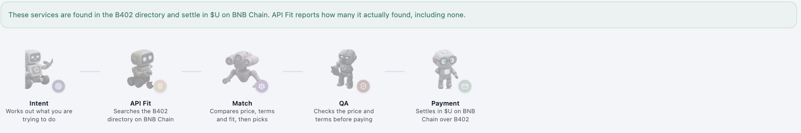

# A Studio Run, End to End

One real run through the MultiAgents API flow, traced from the sentence typed
into the box to the point where a wallet signature is required. It is written
as a worked example rather than a tutorial: everything below is output that
was actually produced, not a mock-up of what the pipeline would say.

Two bugs surfaced during this run. Both are kept in, with how they were
found, because how a failure gets localised is the argument for the
architecture and a walkthrough where nothing goes wrong does not make it.

Read [The Agent Studio](agent-studio.md) first for what each agent is.



## The request

```
I need a text to speech API for a podcast tool, about 200 calls a month,
with a 0.1 stablecoin budget per call.
```

Chosen to exercise three things at once: a capability that has to be
inferred rather than named, a volume figure, and a budget written the way
people actually write budgets rather than as a ticker symbol.

## What each agent produced

| Agent | Result |
|---|---|
| Intent | Need understood: text to speech. Read 'stablecoin' as $U, the asset these services price in. |
| API Fit | Found 20 service(s) for 'text to speech' out of 500 on BNB Chain. |
| Match | Chose `https://api.xona-agent.com/binance/audio/x-text-to-speech` at 0.01 U, from 14 affordable options |
| QA | No blocking findings. |
| Payment | Reports the rail that would settle |

The selection carried through as:

```json
{
  "title": "X.AI text-to-speech: convert text to an MP3.",
  "url": "https://api.xona-agent.com/binance/audio/x-text-to-speech",
  "price": { "units": "10000000000000000", "decimals": 18,
             "symbol": "U", "display": "0.01 U" },
  "merchant": "0x515e7Bce44Baa5F6e42D16d4B5f27768E7f2F8cC",
  "category": "service"
}
```

Note `units` as a string. An 18-decimal amount exceeds JavaScript's
`Number.MAX_SAFE_INTEGER`, so the encoder serialises it as a string rather
than losing precision in the browser before anything renders it.

Worth reading the Match line closely: 20 services were found, 14 were
affordable, and one was chosen from those 14. The 6 that were dropped were
removed by integer arithmetic against the budget before any model saw the
shortlist. A model can pick a worse service here. It cannot pick one that
costs more than the budget allowed, because that option is gone before the
question is asked.

### Which parts of this were live

| Part | How it ran |
|---|---|
| API Fit's 500 services | Live query against the B402 directory on BNB Chain |
| Match's price arithmetic | Deterministic, no model |
| QA | Deterministic, no model |
| Rail check and session | Live against the B402 facilitator on mainnet |
| Intent's language work | Model stubbed, see below |

The model-backed stages were run with `model.reason` stubbed, because the
provider key had no quota left at the time. That is not a workaround, it is a
property the pipeline was built to have: QA is deterministic, the handoff
rail needs no model, and a missing key returns
`{"degraded": true, "would_have": "..."}` rather than raising. The run
completes and explains itself. It is the reason the whole flow can be
exercised in a test without spending quota, and the reason a quota outage
degrades the studio instead of breaking it.

## The payment side

### Rail check, 7 of 7 passed

Run live against the facilitator on BNB Chain mainnet:


| Check | Result |
|---|---|
| Entitlement active | `/supported` returned 10 payment kinds, code 000000000 |
| Asset addresses valid | 10 assets, checksums verified, decimals agree |
| Network is eip155:56 only | all 10 kinds on chain 56, no testnet value |
| Tampered payload rejected | verify returned `isValid=false`, `invalid_exact_evm_payload_authorization_value_mismatch` |
| Requirements held server side | the session stores amount, asset and payTo on the server |
| Rejected payment leaves the session unchanged | refused at verify, session still pending |
| `PAYBOX_PAY_TO` configured | set, and `PLATFORM_FEE_WALLET` unset so they cannot collide |

The fourth and sixth checks are the ones worth understanding. The rail check
does not only confirm that a correct payment works; it submits a deliberately
wrong one and confirms it is refused, and then confirms the refusal left no
trace on the session. A rail that accepts a tampered payload is worse than a
rail that is down.

### What the facilitator accepts

BNB Smart Chain (mainnet), `eip155:56`:


| Asset | Scheme | Method |
|---|---|---|
| U | exact | eip3009 |
| U | exact | permit2-exact |
| U | upto | permit2-upto |
| USD1 | exact | eip3009 |
| USD1 | exact | permit2-exact |
| USD1 | upto | permit2-upto |
| USDT | exact | permit2-exact |
| USDT | upto | permit2-upto |
| USDC | exact | permit2-exact |
| USDC | upto | permit2-upto |

### The session, and where a run stops

Creating a payment session for 0.1 $U returned requirements held on the
server:


```
amount   100000000000000000 base units
asset    0xcE24439F2D9C6a2289F741120FE202248B666666   ($U)
network  eip155:56
```

The line under the panel is the point: the requirements came from the server
and are held there, so the signature is checked against that stored copy and
not against anything the page sends. A page that could name its own amount
would be a page that could be tampered with.

This is where the walkthrough ends, and the stopping point is a design
decision rather than an incomplete test. Settlement needs an EIP-3009 or
Permit2 authorisation signed by the payer's wallet. This backend holds no
private key, so `execute()` without a signed payload reports that a signature
is required and falls through to handoff rather than attempting anything.

The signature comes from the browser. Nothing automated can produce it, which
is the property that makes the studio safe to run against mainnet: the worst
an unattended run can do is select a rail and describe what it would cost.

One practical note when testing. If `PAYBOX_PAY_TO` is the same address as
the connected wallet, a payment is the wallet paying itself. It exercises
sign, verify and settle for real, and moves no value while costing gas. Point
it at a different address for a test that means anything.

## Two bugs, and how the architecture found them

### The budget was read as a token that does not exist

The run stopped at Match with:

```
The budget is in STABLECOIN and these services price in U.
No exchange rate is applied, so no comparison is made.
```

That message contains its own diagnosis, and this is the point of the
architecture. It names the stage that refused, names both symbols, and states
the rule being applied. Match prices in `U` and is deterministic, so `U` is
not in question. `STABLECOIN` therefore came from upstream, and only one
stage writes the budget symbol.

The cause was in Intent. The budget currency is the single money field that
arrives as free text from a model, and it was being uppercased and handed
straight to `Money` as a ticker:

```python
symbol = symbol.strip().upper()
Money.from_decimal_string(amount, 18, symbol)
```

So "a 200 stablecoin budget" produced a budget denominated in a token called
STABLECOIN. Match's refusal was correct, and useless, because there was never
a second currency. There was one currency and a person describing it in
English.

`core/commerce/currency.py` now separates three things that land in that
field, because they are not alike:

| Input | Reading | Result |
|---|---|---|
| `$U`, `u`, `United Stables` | a spelling of the settlement asset | resolves to `U` |
| `stablecoin`, `stable`, `token`, `dollars`, `USD` | a generic word naming no token | resolves to `U`, and the note says so |
| `USDT`, `USDC`, `DAI`, anything unrecognised | a genuinely different token | not converted |

The first two are disambiguation and not conversion. The third keeps the
no-exchange-rate rule, but is asked about at Intent while there is still
someone to ask, rather than dead-ending three stages later at Match.

A generic reading is stated out loud in the stage note, as it is in the
Intent line at the top of this page. A normalisation nobody can see is
indistinguishable from the conversion this codebase refuses to do.

A second fault was underneath it. Both Intent and Profile preferred the
model's re-reading of the original request over an answer the person had just
typed. The request never changes, so the model extracted the same currency
every time and any budget question was re-asked on every resume, with the
answer having nowhere to land. An answered budget now wins, and is in the
settlement asset by construction because that is what the question asks for.

### "Try that agent again" did nothing

The run was stopped at Intent by a provider rate limit, and the studio
offered a retry. Pressing it changed nothing. The server said so plainly:

```
intent   blocked   19793ms      (identical after two presses)
current: None   pending: null   answers: {}
```

The button posted to `/answers`, which resumes a run paused on a QUESTION. A
stage killed by a model outage asks no question, so it sets no `pending`, and
the coordinator read the missing `pending` as nothing to resume:

```python
pending = run.get("pending")
if not pending:
    return public_view(run)      # 200, unchanged, nothing retried
```

The button reported success and did nothing, in exactly the case it existed
for.

`coordinator.retry()` and `POST /api/studio/runs/{run_id}/retry` now re-run
the agent that failed and keep everything before it. The failed agent is
found by its `blocked` state rather than by parsing the error text, because
`_drive`'s finally block sets that state whether or not the failure produced
a tidy message. QA and Payment run after the step list, so a failure in
either resumes at `len(steps)`: the step loop runs nothing and falls straight
through to them.

Verified on production against the same run:

```
BEFORE   intent=blocked  started_at=…819.83  13964ms
AFTER    intent=blocked  started_at=…845.10  12580ms
```

A new timestamp and a new duration, so the stage genuinely re-ran.

The banner that offers the retry was also widened. It matched only the
rate-limit wording, so a run killed by a 503, which says "is busy" and never
"rate limited", ended with no way forward at all. Both halves of the provider
taxonomy are transient and both are now offered.

## Why several agents rather than one

The same work could be one prompt: read the request, search the directory,
pick a service, check it, pay. The reasons it is not are below, and the run
above is the evidence for most of them.

### A failure has an address

`run["error"]` is set to `Stopped at {key}`, and the agent that failed is the
one reporting `blocked`. Both bugs on this page were localised before any
code was read: the currency bug because Match named the stage, the symbols
and the rule, and the retry bug because the run reported `intent blocked` at
an unchanged timestamp after two presses.

The visualisation shows the same thing without reading any state:


One agent is marked, it carries the reason it failed, and the four after it
are visibly untouched rather than collateral damage. The offer is to re-run
that agent, not the run.

In a single prompt, a wrong answer is a wrong answer. There is no stage
boundary to point at and no way to tell a bad budget reading from a bad
service choice, because one call produced both.

### Recovery is cheap and partial

Because each stage writes its results into shared state before the next one
starts, a failure does not cost the whole run. `retry()` re-runs one agent
and keeps the rest; `answer()` resumes at the asking agent and no earlier.
Stages before it are not run again, which matters when API Fit has just
queried 500 services and Context has measured at 74 seconds.

A single call has no partial recovery. Any failure anywhere costs the entire
run and every token spent on it.

### Determinism can be put exactly where it is needed

The split lets the pipeline be probabilistic where judgement is wanted and
deterministic where it is not.

| Work | How it runs | Why |
|---|---|---|
| Reading a request into a need | Model | Language, genuinely a judgement |
| Comparing price to budget | Integer arithmetic | Arithmetic, never a judgement |
| Choosing among affordable options | Model | Which service best fits, a judgement about text |
| Rejecting a cart before payment | Deterministic rules | A payment gate must give the same answer twice |

QA consults no model at all. It works with no API key, cannot be talked out
of a finding by a persuasive product description, and gives the same answer
for the same cart every time. A single prompt cannot offer this: the same
call that exercises judgement also decides whether to spend, and there is no
seam between them.

Match shows the same idea within one stage. Unaffordable options are removed
by arithmetic before the model is asked anything, so the model chooses from a
shortlist that is already safe to buy.

### A blame label can be attached to a finding

Every QA finding names the stage that caused it: `size_missing` is blamed on
Search, `over_budget` on Styling, `budget_unknown` on Profile. That column
only exists because the stages do.

### An agent can stop and ask

A stage returning questions pauses the run with a typed question carrying the
field its answer fills. The coordinator merges the answer and resumes that
agent. With one call there is nowhere to pause: the model either asks inside
its prose, where nothing can route the reply, or it guesses. A guessed budget
is a budget QA later checks a price against, which makes the check
meaningless.

### The person can watch it happen

A run takes real time. Context has measured at 74 seconds and a full physical
run at 111. Because the work is divided, every poll can report which agent is
busy and for how long, instead of a spinner and a guess. The visualisation
invents nothing: an agent is shown as done only when its stage returned, and
blocked only when a stage said so.

### What it costs

Stated so the trade is visible rather than implied:

- Latency is the sum of the stages, not the fastest path through them.
- Each model-backed stage is its own call, so quota is consumed per stage and
  a quota outage can stop a run partway rather than at the start.
- There are more moving parts, and the coordinator is one of them.
- Run state lives in memory and is evicted after 30 minutes, so a run cannot
  be resumed after a backend restart.

The first two are real costs of the design. The last two are limits of this
implementation rather than of the approach.

## Reproducing this

```
POST /api/studio/runs            {"flow": "api", "request": "..."}  -> run_id
GET  /api/studio/runs/{run_id}                                      -> poll
POST /api/studio/runs/{run_id}/answers   {"answers": {...}}         -> resume
POST /api/studio/runs/{run_id}/retry                                -> re-run the failed agent
GET  /api/commerce/readiness                                        -> what the pipeline could do now
```

`GET /api/commerce/readiness` reports the model's status, a dry-run quote
from every rail, and the state of each stage, without returning a key. It is
the fastest way to see why a run behaved as it did before starting another
one.
