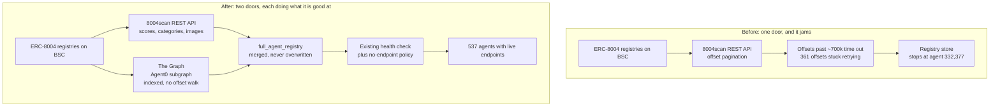

# The Graph: Agent0 ERC-8004 subgraph integration

Built 2026-09-04 during ETHGlobal Online. This page documents what the integration does, what was measured before building it, and where it deliberately stops.

## The problem it solves

Tnega's registry ingestion reads 8004scan's REST API. That source has a hard ceiling: deep-offset pagination stops answering. Checked live before any of this was written, with the API key that works fine at shallow offsets:

| Offset | Result |
|---|---|
| 0 | 200 OK in ~1.1s |
| 700,000 | ReadTimeout |
| 806,000 | ReadTimeout |
| 808,000 | ReadTimeout |

The consequence is visible in the pipeline's own state: **361 offsets** sit in `full_registry_skipped_offsets`, retried automatically at the head of every ingest batch and failing every time with 500s and timeouts. That is not a transient outage, it is the limit of what this project can see through that source.

The Graph's own documentation makes the relevant claim plainly: *"No RPC limits: Skip rate-limited RPC scans and IPFS round-trips. One query, one response."* The [Agent0 subgraphs](https://github.com/agent0lab/subgraph), built with The Graph, index the same ERC-8004 Identity, Reputation and Validation registries this project already reads.

## Before and after, as a diagram



## Measured comparison, run before building anything

Live BSC subgraph `D6aWqowLkWqBgcqmpNKXuNikPkob24ADXCciiP8Hvn1K`, deployment `QmaNus7TyK4uBnUqd4J12XddVjZMifh4EB3wKz3SzQ6huS`.

### What The Graph provides that 8004scan does not

- **Pagination that does not stop.** 2,399 BSC agents above the highest id this project had stored, returned in **1.5 seconds across three queries**, in precisely the range 8004scan times out on.
- **Current chain state.** Subgraph high-water mark was agent `334,776` against a stored maximum of `332,377`, with the newest agent created minutes before the query.
- **Structured protocol endpoints** as first-class fields: `mcpEndpoint`, `a2aEndpoint`, `webEndpoint`, `oasfEndpoint`, plus `oasfSkills`, `oasfDomains` and `mcpTools`. 8004scan returns raw metadata and nothing equivalent.
- **Feedback provenance**: `clientAddress`, `tag1`/`tag2`, `isRevoked`, `feedbackIndex`, rather than only an aggregate count.
- **Validation Registry access.** 8004scan has no endpoint for it at all.

### What 8004scan provides that The Graph cannot

`total_score`, `star_count`, the Quality Center assessment, `category`, `image_url`, `owner_ens` and `owner_username`. These are computed off-chain, so a subgraph indexing on-chain registries structurally cannot carry them. Coverage in the stored BSC set is 100% for score and category and 91.2% for images, all of it from 8004scan.

### Verdict

**A coverage fallback and a corroboration source, not a replacement.** Neither source is a superset of the other.

## Two things checked specifically

**The stuck offsets: yes.** This is the outcome that matters. The agents 8004scan cannot deliver are returned by the subgraph in seconds.

**The Validation Registry: no signal, honestly reported.** Both `validations` and `validationPoints` return **empty arrays** across all of BSC. The registry is deployed and queryable but has never been used on that chain. `adapters/thegraph.py` exposes it because the capability is real and other chains may populate it, but nothing in the evaluation system treats an empty result as a signal about an agent, and no UI claims otherwise.

## One measured limitation

Only **1.7%** of sampled BSC registration files carry any endpoint (mcp 0.4%, a2a 1.2%, web 0.7%); 8.8% declare `x402Support`. So this source cannot determine `service_status`. `core/agent_health.py`'s live probe stays the only thing that can answer whether an endpoint actually responds.

## How it is wired in

`adapters/thegraph.py` holds the client: `get_health`, `fetch_agents_after`, `fetch_agent`, `fetch_agent_feedback`, `fetch_agent_validations`, and `to_registry_doc`.

`core/full_registry_ingest.py`'s `run_thegraph_backfill_batch()` is the pipeline entry point. It finds the highest agent id already stored for a chain and asks the subgraph for everything above it, closing the gap from the opposite end to 8004scan's forward pagination.

Rows merge with `$set`, exactly like the 8004scan path, and `to_registry_doc` writes only fields the subgraph genuinely knows. It does not invent `total_score`, `star_count`, `category` or `image_url`, so a later 8004scan pass fills those in rather than this source overwriting them with nulls. Every row it writes carries `source: "thegraph:agent0"` so provenance stays auditable.

The data feeds the systems that already exist rather than a separate display: `supported_protocols` (derived from the structured endpoint fields) is what `core/protocol_compat.py` reasons over, and `x402_supported` is already consumed across the marketplace.

## Verified result, end to end

The completed run, with the fixed code:

```
started_above_agent_id : 333,256
fetched                : 1,000
upserted               : 994
highest_seen           : 334,256
elapsed                : 668.4s
```

What survives matters more than the raw fetch count, because the backfill composes with machinery this project already had. Every backfilled row was picked up by the existing analysis loop and health-checked, and `core/full_registry_analysis.py`'s no-endpoint policy then deleted the ones with nothing to reach:

| | |
|---|---|
| Tagged `source: thegraph:agent0` | **539** |
| of those, `responding` | **537** |
| `not_responding` | 1 |
| `unknown` | 1 |
| Stored high-water mark | **334,250** (was 332,377) |

So the outcome is not "1,000 rows added". It is **537 agents with live, responding endpoints** that 8004scan could not deliver at any speed, arriving with a verified service status. A tagged count that falls between two measurements is the no-endpoint policy doing its job, not data loss.

One honest note on the 668 seconds: that is almost entirely MongoDB write time on this Atlas free tier, not The Graph, which returned its 1,000 agents in under a second. The bottleneck has moved from the data source to our own storage.

## Two bugs the live test caught

Recorded because both would have shipped silently:

- The first version found the highest stored agent id by sorting `token_id` descending. `token_id` is stored as a **string**, so lexical order puts `"99979"` above `"332377"`. It reported a maximum of 99,979 when the real one was 332,377 and would have re-fetched a third of the registry on every run. Now computed with an aggregation that converts to a number first.
- A single 1000-operation `bulk_write` against this Atlas tier returns `MaxTimeMSExpired`. Writes now go out in chunks of 200.

## Reproducing

```bash
curl -s -X POST \
  "https://gateway.thegraph.com/api/$THEGRAPH_API_KEY/subgraphs/id/D6aWqowLkWqBgcqmpNKXuNikPkob24ADXCciiP8Hvn1K" \
  -H 'Content-Type: application/json' \
  -d '{"query":"{ _meta { block { number } } agents(first:3, orderBy: agentId, orderDirection: desc) { agentId owner registrationFile { name } } }"}'
```

Note that the gateway rejects requests sent with Python's default `urllib` User-Agent (403 on an otherwise identical query that returns 200 from `httpx` and `curl`). The adapter uses `httpx`, which is what the rest of this backend uses anyway.
