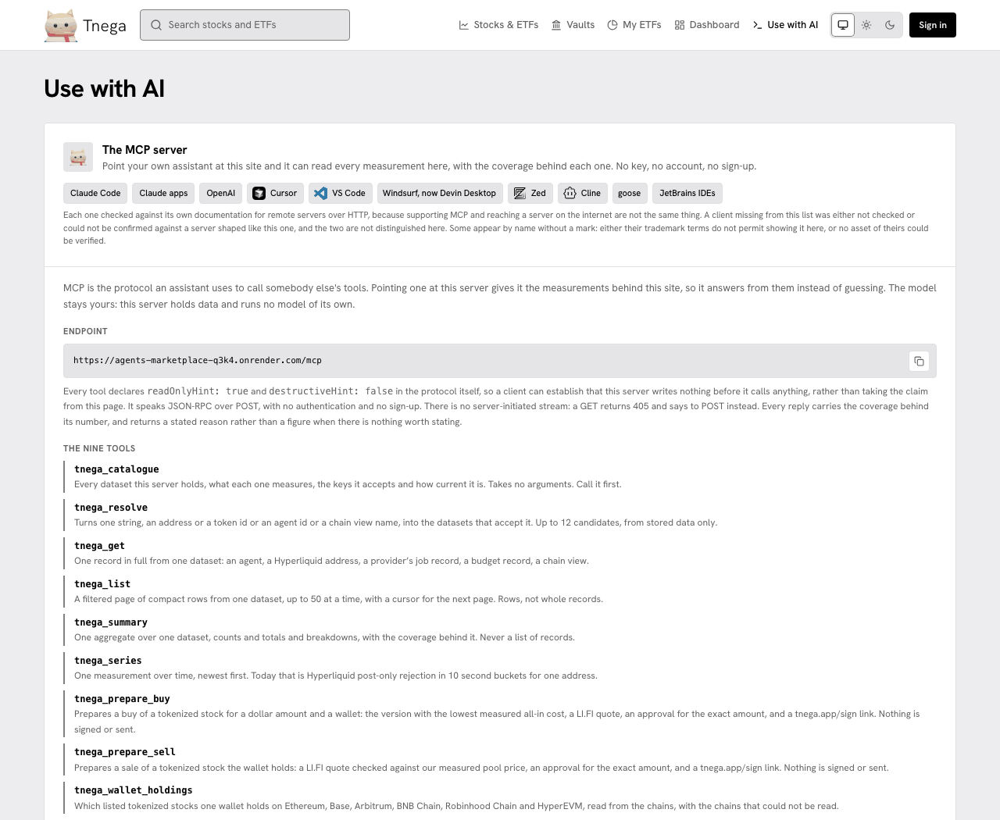

# Use with AI

Use with AI (`/ai`) is the page that connects your assistant to Tnega: an MCP
server that answers from the measurements on this site, with the coverage
behind each one. No key, no account, no sign-up. The server holds data and
runs no model of its own.

The screenshot is this page as built from this documentation's branch, taken on
30 September 2026. Its header row was updated on 1 October 2026 to show the Docs link; everything under the header is as taken.

What the page holds:

- **The endpoint**, `https://mcp.tnega.app/mcp`, JSON-RPC over POST, no authentication.
- **The nine tools**, one line each. They are listed in full on [MCP tools](mcp-tools.md).
- **The one command**, `npx tnega-mcp`, which writes one config entry through the client's own command line and does nothing else, and what it runs underneath.
- **The config entry for other clients**, and each client's own config shape with the date it was read from that client's documentation.
- **Calling it without a client**: a `curl` request that lists the tools.
- **The sequence**: add the server, restart the client, ask for `tnega_catalogue` first, and read the coverage, not just the number.

Every tool declares `readOnlyHint: true` in the protocol itself. The two
prepare tools return a `tnega.app/sign` link; on that page you sign every
transaction in your own wallet, or nothing happens.

For the whole route from a question to a signed purchase, see
[Buy a tokenized stock through your assistant](buy-with-your-assistant.md).
