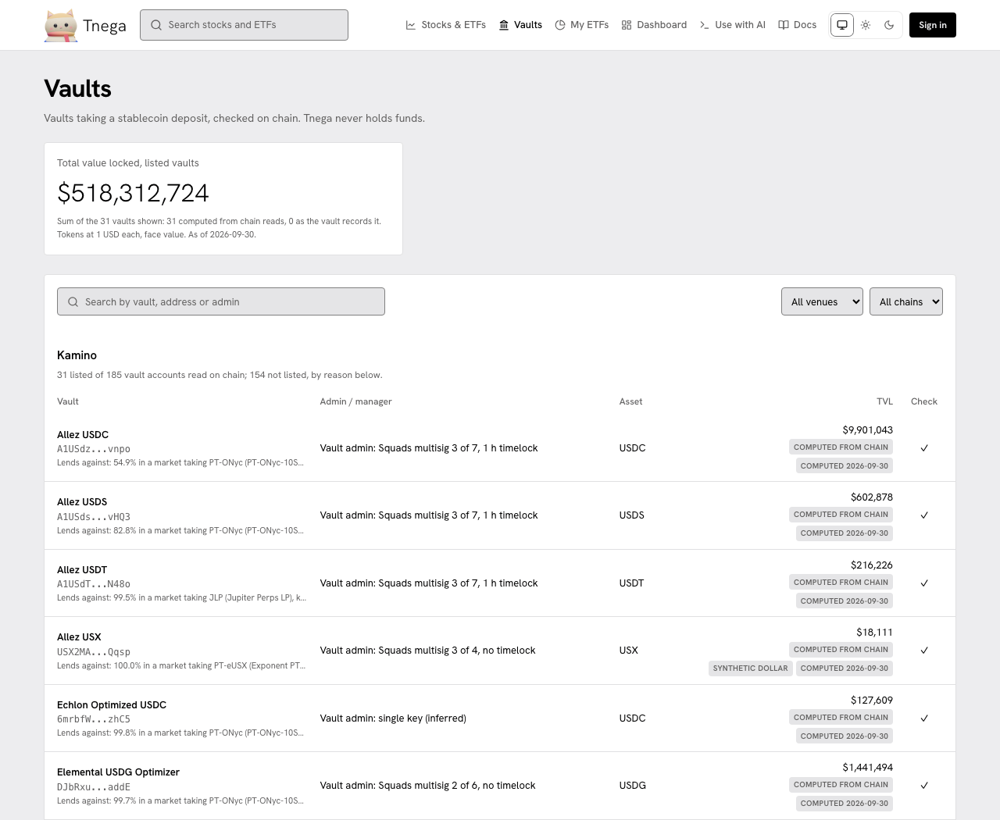

# Vaults

Vaults (`/vaults`) lists vaults that take a stablecoin deposit, with what each
one lends against, who can change it, and its total value, computed from chain
reads. Tnega never holds funds and takes no deposit: deposits are made on each
vault's own venue, signed in your own wallet. Nothing on the page is advice.

The screenshot was taken on https://www.tnega.app on 30 September 2026 at
21:05 UTC. Its header row was updated on 1 October 2026 to show the Docs link; everything under the header is as taken.

On 30 September the page listed 31 vaults, all Kamino vaults on Solana, out of
185 Kamino vault accounts read on chain, with a total of $518,312,724 (tokens counted
at $1 each, face value). The other 154 Kamino accounts are not listed, and the page gives the
reason for each group.

## Each row

| Column | What it is |
|---|---|
| Vault | Its name and address, and what it lends against: the share in each market and the collateral each market takes |
| Admin / manager | Who can change the vault, for example "Squads multisig 3 of 7, 1 h timelock" |
| Asset | The stablecoin deposited. USX and USDe are labelled as synthetic dollars |
| TVL | The total value, labelled "computed from chain" with its date and the formula used, or "as the vault records it" |
| Check | ✓ the figures reconcile; ⚠ recorded by the vault, not reconciled, or stale; ? a partial read |

## What is listed, and what is not

Listed: vaults taking a stablecoin deposit. What a listed vault lends against
is shown per vault, and is often crypto, so these are not real-world-asset
vaults. Not listed, among others: vaults placing funds with Drift; Kamino vaults
lending into Kamino's institutional-yield markets; Voltr vaults with an
off-chain, closed or unlisted position; GLAM vaults that are not tokenized, can
bridge, or allow non-stablecoin assets; test, staging or demo vaults; and
vaults holding under 1,000 tokens.

Venues that were read and have no vault meeting the rule are named under
"Venues with nothing listed", each with its reason and the slot or source read.
On 30 September that was GLAM (76 GLAM vault accounts read on chain, at slot
452,075,948), Voltr (200 Voltr vault accounts read on chain, at slot
452,075,937), Hyperliquid and HyperEVM.

Kamino and GLAM figures are Tnega's chain reads (Solana, through Helius);
Voltr positions are as recorded by the vault. No history is kept yet, so there
is no 30-day return and no vault age.
